# Agentic AI Glossary - Version 2.0

**Last Updated**: January 2025  
**Purpose**: Comprehensive reference for AI/agentic consulting propositions and enterprise implementations

---

## Table of Contents

1. [Core Agentic Concepts](#core-agentic-concepts)
2. [Architecture & Infrastructure](#architecture--infrastructure)
3. [Agent Capabilities & Behaviors](#agent-capabilities--behaviors)
4. [Safety & Governance](#safety--governance)
5. [Evaluation & Testing](#evaluation--testing)
6. [Knowledge Representation](#knowledge-representation)
7. [Integration Patterns](#integration-patterns)
8. [Business & Strategy](#business--strategy)

---

## Core Agentic Concepts

### Agent

**Definition**: An AI system capable of autonomous goal-directed behavior through perception, reasoning, planning, and action in an environment.

**Key Characteristics**:
- **Autonomy**: Operates without constant human intervention
- **Reactivity**: Responds to environmental changes
- **Proactivity**: Takes initiative to achieve goals
- **Social Ability**: Interacts with other agents or humans

**Types**:
- **Reactive Agents**: Respond to stimuli without internal state
- **Deliberative Agents**: Plan actions based on internal models
- **Hybrid Agents**: Combine reactive and deliberative approaches
- **Learning Agents**: Improve performance through experience

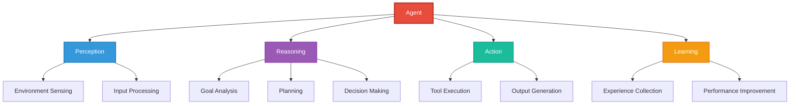

**Business Value**: Agents automate complex workflows, reduce human cognitive load, and scale expertise across organizations.

---

### Agentic AI

**Definition**: AI systems exhibiting agency—the capacity for independent, goal-directed action within defined constraints, typically powered by large language models (LLMs) augmented with tools, memory, and planning capabilities.

**Distinguishing Features**:
- **Goal Decomposition**: Breaking complex objectives into manageable subtasks
- **Tool Use**: Leveraging external APIs, databases, and services
- **Multi-step Reasoning**: Following chains of thought across multiple iterations
- **Error Recovery**: Detecting and correcting mistakes autonomously
- **Context Maintenance**: Preserving state across extended interactions

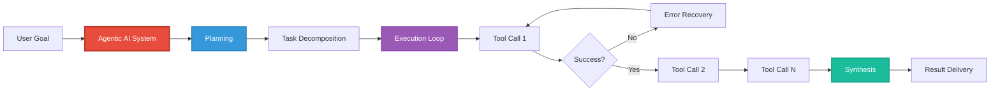

**Comparison with Traditional AI**:

| **Traditional AI** | **Agentic AI** |
|-------------------|----------------|
| Single-task optimization | Multi-task coordination |
| Predefined workflows | Dynamic planning |
| Passive response | Proactive action |
| Limited context | Extended memory |
| Fixed capabilities | Tool-augmented flexibility |

---

### Harness

**Definition**: An orchestration framework that provides the infrastructure, guardrails, and coordination mechanisms for AI agents to execute tasks safely, reliably, and measurably within defined boundaries.

**Core Components**:

1. **Execution Environment**
   - Sandbox/container isolation
   - Resource management (CPU, memory, API quotas)
   - State management and persistence
   - Session control

2. **Tool & API Integration Layer**
   - Tool registry and discovery
   - Permission and access control
   - Rate limiting and throttling
   - Input/output validation

3. **Guardrails & Safety Mechanisms**
   - Prompt injection protection
   - Output filtering and validation
   - Human-in-the-loop approval workflows
   - Rollback and undo capabilities
   - Budget and cost controls

4. **Monitoring & Observability**
   - Comprehensive logging
   - Distributed tracing
   - Performance metrics collection
   - Audit trail generation

5. **Orchestration & Coordination**
   - Task routing to appropriate agents
   - Agent-to-agent handoffs
   - Workflow state machine enforcement
   - Failure handling and retry logic

6. **Evaluation & Testing Framework**
   - Automated test suite execution
   - Performance benchmarking
   - A/B testing infrastructure
   - Regression detection

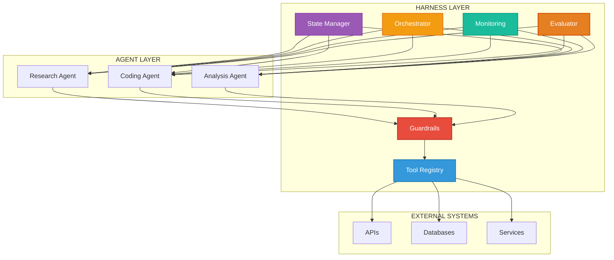

**ASCII Architecture Diagram**:
```
┌─────────────────────────────────────────────────────────────┐
│                      HARNESS LAYER                          │
├─────────────────────────────────────────────────────────────┤
│                                                             │
│  ┌──────────────┐  ┌──────────────┐  ┌──────────────┐     │
│  │  Guardrails  │  │ Tool Registry│  │ State Manager│     │
│  │  • Filters   │  │ • APIs       │  │ • Sessions   │     │
│  │  • Approval  │  │ • Functions  │  │ • Context    │     │
│  │  • Budgets   │  │ • Permissions│  │ • Memory     │     │
│  └──────────────┘  └──────────────┘  └──────────────┘     │
│                                                             │
│  ┌──────────────┐  ┌──────────────┐  ┌──────────────┐     │
│  │  Monitoring  │  │ Orchestrator │  │  Evaluator   │     │
│  │  • Logging   │  │ • Routing    │  │  • Metrics   │     │
│  │  • Tracing   │  │ • Handoffs   │  │  • Testing   │     │
│  │  • Metrics   │  │ • Workflows  │  │  • Benchmarks│     │
│  └──────────────┘  └──────────────┘  └──────────────┘     │
│                                                             │
├─────────────────────────────────────────────────────────────┤
│                      AGENT LAYER                            │
│  ┌──────────┐  ┌──────────┐  ┌──────────┐  ┌──────────┐  │
│  │Research  │  │ Coding   │  │ Analysis │  │ Writing  │  │
│  │  Agent   │  │  Agent   │  │  Agent   │  │  Agent   │  │
│  └──────────┘  └──────────┘  └──────────┘  └──────────┘  │
│                                                             │
├─────────────────────────────────────────────────────────────┤
│                   EXTERNAL SYSTEMS                          │
│  ┌──────────┐  ┌──────────┐  ┌──────────┐  ┌──────────┐  │
│  │   APIs   │  │ Databases│  │ Services │  │  Tools   │  │
│  └──────────┘  └──────────┘  └──────────┘  └──────────┘  │
└─────────────────────────────────────────────────────────────┘
```

**Types of Harnesses**:

| Type | Purpose | Examples | Key Features |
|------|---------|----------|--------------|
| **Development** | Local building/testing | LangChain, LlamaIndex | Rapid prototyping, flexible tools |
| **Production** | Live deployment | AWS Bedrock Agents, Azure AI | Reliability, security, SLAs |
| **Evaluation** | Systematic testing | Inspect AI, AgentOps | Automated benchmarks, metrics |
| **Research** | Academic exploration | BabyAGI, AutoGPT | Minimal constraints, extensive logging |

**Harness vs. Framework vs. Platform**:

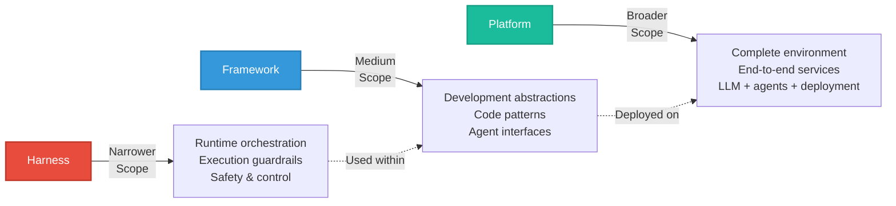

**Critical Success Factors**:
- Balance autonomy and control
- Provide observability without overhead
- Enable iterative improvement through metrics
- Scale economically with resource management
- Support compliance and auditability
- Facilitate testing and debugging

**Business Value**: Harnesses transform experimental agents into production-ready systems, enabling sustainable competitive advantage through controlled innovation, quality assurance, and risk mitigation.

---

### Multi-Agent System (MAS)

**Definition**: A system composed of multiple interacting intelligent agents, each with specialized capabilities, working collaboratively or competitively to achieve individual or collective goals.

**Coordination Patterns**:
- **Hierarchical**: Manager agent delegates to specialist agents
- **Peer-to-Peer**: Agents collaborate as equals
- **Market-Based**: Agents bid for tasks based on capability
- **Blackboard**: Agents contribute to shared knowledge space

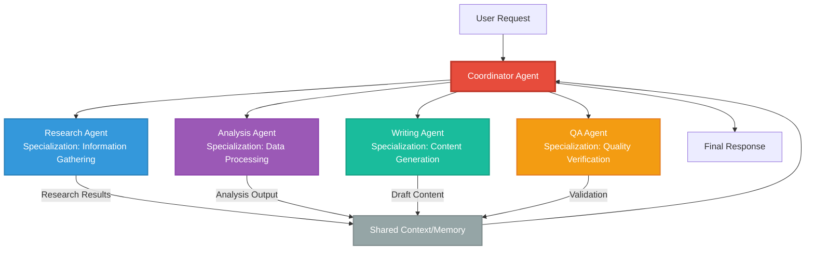

**ASCII Diagram - Multi-Agent Workflow**:
```
                    ┌─────────────────┐
                    │  User Request   │
                    └────────┬────────┘
                             │
                    ┌────────▼────────┐
                    │  Coordinator    │
                    │     Agent       │
                    └────────┬────────┘
                             │
         ┌───────────────────┼───────────────────┐
         │                   │                   │
    ┌────▼─────┐      ┌─────▼─────┐      ┌─────▼─────┐
    │ Research │      │ Analysis  │      │  Writing  │
    │  Agent   │      │   Agent   │      │   Agent   │
    └────┬─────┘      └─────┬─────┘      └─────┬─────┘
         │                  │                   │
         └──────────────────┼───────────────────┘
                            │
                    ┌───────▼────────┐
                    │ Shared Context │
                    │    & Memory    │
                    └───────┬────────┘
                            │
                    ┌───────▼────────┐
                    │     Output     │
                    └────────────────┘
```

**Benefits**:
- **Specialization**: Each agent focuses on specific expertise
- **Parallelization**: Multiple agents work simultaneously
- **Resilience**: System continues if individual agents fail
- **Scalability**: Add agents for new capabilities

**Challenges**:
- **Coordination Overhead**: Communication between agents adds complexity
- **Conflict Resolution**: Agents may produce contradictory outputs
- **State Synchronization**: Maintaining consistent shared knowledge
- **Attribution**: Determining which agent caused which outcome

---

## Architecture & Infrastructure

### Tool/Function Calling

**Definition**: The capability of an LLM to invoke external functions, APIs, or tools to extend its capabilities beyond text generation, enabling interaction with real-world systems.

**Mechanism**:
1. **Tool Definition**: Functions described with names, parameters, and descriptions
2. **LLM Decision**: Model decides which tool(s) to call based on user query
3. **Parameter Extraction**: Model generates structured function arguments
4. **Execution**: Harness executes function with LLM-provided parameters
5. **Result Integration**: Tool output fed back to LLM for synthesis

```mermaid
sequenceDiagram
    participant U as User
    participant LLM as LLM Agent
    participant H as Harness
    participant T as Tool/API
    
    U->>LLM: Query: "What's the weather in London?"
    
    LLM->>LLM: Analyze Query<br/>Determine Tool Needed
    
    LLM->>H: Tool Call Request<br/>get_weather(city="London")
    
    H->>H: Validate Request<br/>Check Permissions
    
    H->>T: Execute API Call<br/>GET /weather?city=London
    
    T-->>H: Return Data<br/>{temp: 15, condition: "cloudy"}
    
    H-->>LLM: Tool Result<br/>Weather data
    
    LLM->>LLM: Synthesize Response
    
    LLM-->>U: "It's 15°C and cloudy in London"
    
    style LLM fill:#E74C3C,stroke:#C0392B,stroke-width:2px,color:#fff
    style H fill:#3498DB,stroke:#2980B9,stroke-width:2px,color:#fff
    style T fill:#1ABC9C,stroke:#16A085,stroke-width:2px,color:#fff
```

**Example Tool Schema (OpenAI Format)**:
```json
{
  "name": "get_weather",
  "description": "Get current weather for a location",
  "parameters": {
    "type": "object",
    "properties": {
      "location": {
        "type": "string",
        "description": "City name, e.g. 'London, UK'"
      },
      "unit": {
        "type": "string",
        "enum": ["celsius", "fahrenheit"],
        "description": "Temperature unit"
      }
    },
    "required": ["location"]
  }
}
```

**Best Practices**:
- Clear, unambiguous tool descriptions
- Robust error handling for tool failures
- Validation of LLM-generated parameters
- Rate limiting to prevent abuse
- Logging of all tool invocations

---

### ReAct (Reasoning + Acting)

**Definition**: A prompting pattern where agents alternate between reasoning (thought generation) and acting (tool execution), creating an observable chain of logic.

**Pattern Structure**:
```
Thought: [Agent's reasoning about what to do next]
Action: [Tool/function to invoke]
Observation: [Result from the action]
... (repeat as needed)
Final Answer: [Synthesized response to user]
```

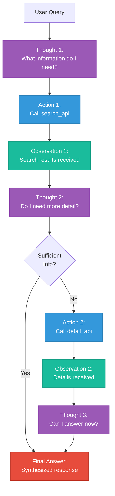

**Example Execution**:
```
User: Find recent papers on quantum computing and summarize key findings.

Thought: I need to search for recent academic papers on quantum computing.
Action: search_papers(query="quantum computing", years="2023-2024")
Observation: Found 15 papers including "Quantum Error Correction Advances" 
             and "Scalable Quantum Processors"

Thought: I should get details on the top 3 most cited papers.
Action: get_paper_details(paper_ids=["123", "456", "789"])
Observation: Retrieved abstracts and key findings for 3 papers.

Thought: I now have enough information to summarize.
Final Answer: Recent quantum computing research focuses on three key areas:
1. Error correction techniques improving qubit stability...
2. Scalable processor architectures enabling 1000+ qubit systems...
3. Novel algorithms for optimization problems...
```

**Benefits**:
- **Transparency**: Observable reasoning process
- **Debuggability**: Can trace where agent logic fails
- **Error Recovery**: Agent can self-correct based on observations
- **Auditability**: Clear decision trail for compliance

---

### Chain-of-Thought (CoT)

**Definition**: A prompting technique that encourages LLMs to break down complex problems into intermediate reasoning steps before producing a final answer.

**Types**:

1. **Zero-Shot CoT**: Simply append "Let's think step by step" to prompt
2. **Few-Shot CoT**: Provide examples showing step-by-step reasoning
3. **Auto-CoT**: Automatically generate reasoning chains for diverse problems

```mermaid
graph LR
    Q[Complex Question] --> CoT[Chain of Thought]
    
    CoT --> S1[Step 1:<br/>Understand Problem]
    S1 --> S2[Step 2:<br/>Identify Subproblems]
    S2 --> S3[Step 3:<br/>Solve Subproblem A]
    S3 --> S4[Step 4:<br/>Solve Subproblem B]
    S4 --> S5[Step 5:<br/>Combine Results]
    S5 --> A[Final Answer]
    
    style Q fill:#E74C3C,stroke:#C0392B,stroke-width:2px,color:#fff
    style CoT fill:#3498DB,stroke:#2980B9,stroke-width:3px,color:#fff
    style A fill:#1ABC9C,stroke:#16A085,stroke-width:2px,color:#fff
```

**Example**:
```
Question: If a train travels 120 km in 2 hours, then slows to half speed 
          for the next 3 hours, how far does it travel in total?

Without CoT:
Answer: 300 km [Often incorrect]

With CoT:
Step 1: Calculate initial speed = 120 km / 2 hours = 60 km/h
Step 2: Calculate slowed speed = 60 km/h / 2 = 30 km/h
Step 3: Calculate distance in first segment = 120 km
Step 4: Calculate distance in second segment = 30 km/h × 3 hours = 90 km
Step 5: Total distance = 120 km + 90 km = 210 km
Answer: 210 km [Correct]
```

**When to Use**:
- Mathematical reasoning
- Multi-step logical problems
- Complex decision-making
- Situations requiring explicit justification

---

### Retrieval-Augmented Generation (RAG)

**Definition**: A technique that enhances LLM responses by retrieving relevant information from external knowledge sources before generation, grounding outputs in factual data.

**Architecture**:

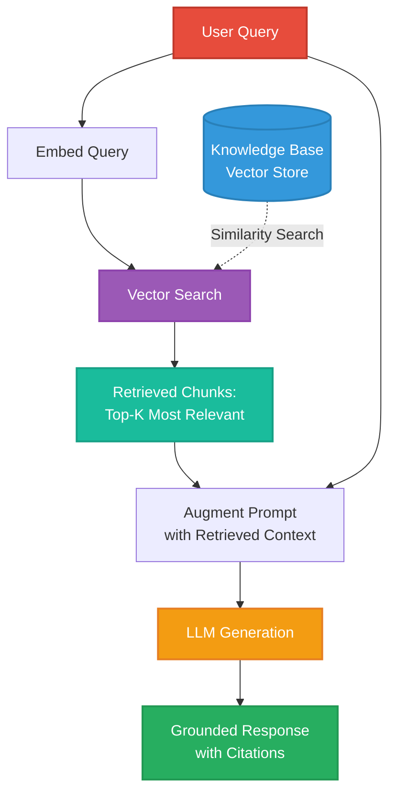

**ASCII Diagram - RAG Pipeline**:
```
┌──────────────┐
│  User Query  │
└──────┬───────┘
       │
       ▼
┌──────────────────┐
│ Embed Query      │
│ (Vector Encoding)│
└──────┬───────────┘
       │
       ▼
┌──────────────────────────────┐
│  Vector Similarity Search    │
│  ┌────────────────────────┐  │
│  │   Knowledge Base       │  │
│  │   (Vector Store)       │  │
│  │  • Documents           │  │
│  │  • Embeddings          │  │
│  │  • Metadata            │  │
│  └────────────────────────┘  │
└──────┬───────────────────────┘
       │
       ▼
┌──────────────────┐
│ Top-K Retrieval  │
│ (Most Relevant)  │
└──────┬───────────┘
       │
       ▼
┌──────────────────┐
│ Augment Prompt:  │
│ Context + Query  │
└──────┬───────────┘
       │
       ▼
┌──────────────────┐
│  LLM Generation  │
└──────┬───────────┘
       │
       ▼
┌──────────────────┐
│ Grounded Response│
│  + Citations     │
└──────────────────┘
```

**Components**:
1. **Document Chunking**: Split documents into retrievable segments
2. **Embedding Model**: Convert text to vector representations
3. **Vector Store**: Database optimized for similarity search (Pinecone, Weaviate, ChromaDB)
4. **Retrieval Strategy**: Top-K, MMR (Maximum Marginal Relevance), hybrid search
5. **Prompt Augmentation**: Inject retrieved context into LLM prompt

**Variants**:
- **Naive RAG**: Simple retrieve-then-generate
- **Advanced RAG**: Pre-retrieval query optimization, post-retrieval re-ranking
- **Modular RAG**: Combine retrieval with routing, fusion, and iteration

**Benefits**:
- **Factuality**: Reduces hallucination by grounding in real data
- **Freshness**: Access to up-to-date information beyond training data
- **Attribution**: Can cite specific sources
- **Privacy**: Keep sensitive data in controlled knowledge base

---

### Prompt Engineering

**Definition**: The systematic design and optimization of text inputs to LLMs to elicit desired behaviors, improve output quality, and achieve specific objectives.

**Core Techniques**:

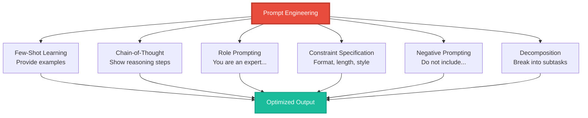

**Prompt Structure Template**:
```
[ROLE/CONTEXT]
You are an expert data analyst with 15 years of experience in 
financial services.

[TASK]
Analyze the following quarterly revenue data and identify trends.

[CONSTRAINTS]
- Provide exactly 3 key insights
- Use bullet points
- Include specific percentage changes
- Do not speculate beyond the data provided

[INPUT DATA]
Q1 2024: $2.3M
Q2 2024: $2.7M
Q3 2024: $2.5M
Q4 2024: $3.1M

[OUTPUT FORMAT]
Format your response as:
## Key Insights
1. [Insight with data]
2. [Insight with data]
3. [Insight with data]
```

**Advanced Patterns**:
- **Persona Pattern**: "Adopt the perspective of [specific expert]"
- **Template Pattern**: Provide structured output format
- **Cognitive Verifier**: "First, list what you know. Then, list what you don't know. Finally, answer."
- **Flipped Interaction**: "Ask me questions to understand my needs before proceeding"

---

### Context Window

**Definition**: The maximum amount of text (measured in tokens) that an LLM can process in a single request, encompassing both input prompt and generated output.

**Token Limits by Model** (as of 2025):
- GPT-4 Turbo: 128K tokens
- Claude 3 Opus/Sonnet: 200K tokens  
- Gemini 1.5 Pro: 2M tokens
- GPT-4o: 128K tokens

```mermaid
graph LR
    subgraph "Context Window (e.g., 128K tokens)"
        SP[System Prompt<br/>5K tokens]
        UC[User Context<br/>20K tokens]
        H[Conversation History<br/>30K tokens]
        RT[Retrieved Context (RAG)<br/>40K tokens]
        R[Reserved for Response<br/>33K tokens]
    end
    
    SP --> Total[Total: 128K tokens]
    UC --> Total
    H --> Total
    RT --> Total
    R --> Total
    
    style SP fill:#E74C3C,stroke:#C0392B,stroke-width:2px,color:#fff
    style UC fill:#3498DB,stroke:#2980B9,stroke-width:2px,color:#fff
    style H fill:#9B59B6,stroke:#8E44AD,stroke-width:2px,color:#fff
    style RT fill:#1ABC9C,stroke:#16A085,stroke-width:2px,color:#fff
    style R fill:#F39C12,stroke:#E67E22,stroke-width:2px,color:#fff
```

**Context Window Management Strategies**:

1. **Summarization**: Compress older conversation history
2. **Sliding Window**: Keep only recent N messages
3. **Relevance Filtering**: Retain only contextually important messages
4. **External Memory**: Store context in vector database, retrieve on demand
5. **Hierarchical Processing**: Break large documents into chunks, process separately

**Token Estimation**:
- English: ~1 token ≈ 4 characters or 0.75 words
- Code: Varies by language, ~1 token ≈ 2-3 characters

---

## Agent Capabilities & Behaviors

### Planning

**Definition**: The agent's ability to decompose complex goals into actionable subtasks, sequence them logically, and adapt the plan based on execution results.

**Planning Strategies**:

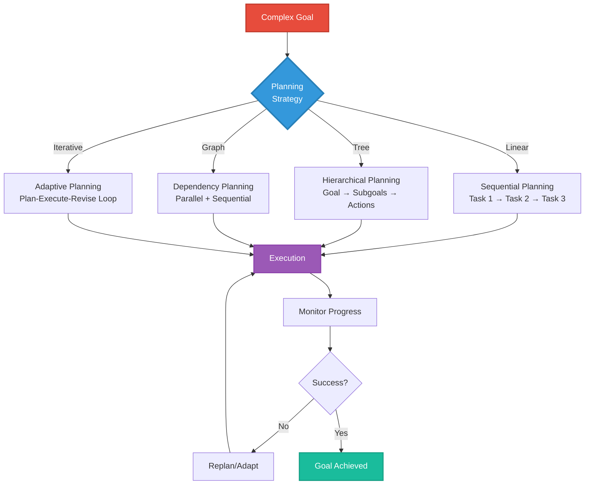

**Example - Research Task Decomposition**:
```
Goal: Write a comprehensive report on renewable energy trends

Plan:
├─ 1. Information Gathering
│  ├─ 1a. Search for recent reports (2023-2024)
│  ├─ 1b. Identify key statistics
│  └─ 1c. Find expert opinions
├─ 2. Analysis
│  ├─ 2a. Compare data across sources
│  ├─ 2b. Identify trends and patterns
│  └─ 2c. Synthesize insights
└─ 3. Report Generation
   ├─ 3a. Create outline
   ├─ 3b. Write sections
   ├─ 3c. Add visualizations
   └─ 3d. Review and refine
```

**Planning Frameworks**:
- **Plan-and-Execute**: Generate complete plan upfront, then execute
- **ReWOO (Reasoning WithOut Observation)**: Plan all tool calls before execution
- **LLMCompiler**: Plan with task dependencies, execute in parallel where possible

---

### Memory

**Definition**: The agent's capacity to store, retrieve, and utilize information from past interactions, enabling continuity and personalization across sessions.

**Memory Types**:

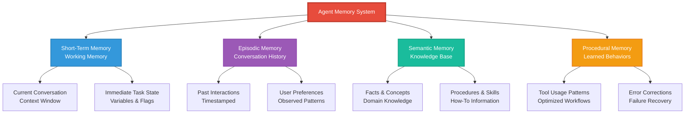

**Implementation Approaches**:

1. **In-Context Memory**: Store within conversation context window
   - Pros: Simple, no external dependencies
   - Cons: Limited by token constraints

2. **External Memory Store**: Database or vector store
   - Pros: Unbounded capacity, persistent across sessions
   - Cons: Retrieval latency, relevance ranking challenges

3. **Hybrid Approach**: Recent in context + historical in database
   - Pros: Fast access to recent, searchable long-term
   - Cons: Complexity in synchronization

**Memory Operations**:
- **Store**: Save new information with metadata (timestamp, importance)
- **Retrieve**: Query memory based on relevance to current task
- **Update**: Modify existing memories based on new information
- **Forget**: Prune irrelevant or outdated information

---

### Reflection

**Definition**: The agent's capability to evaluate its own performance, identify errors or suboptimal decisions, and adjust behavior accordingly.

**Reflection Loop**:

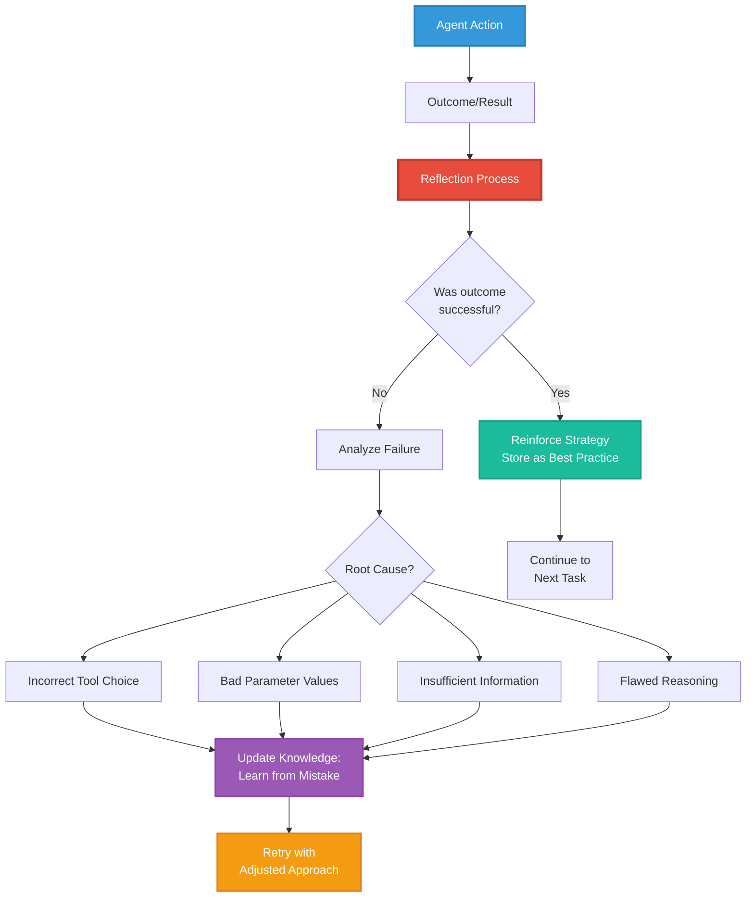

**Reflection Techniques**:

1. **Self-Critique**: Agent evaluates own output quality
   ```
   Prompt: "Review your previous answer. Identify any errors, 
           inconsistencies, or areas for improvement."
   ```

2. **Reflexion**: Generate verbal reinforcement or corrective feedback
   ```
   Example:
   Initial Answer: [Incorrect calculation]
   Reflection: "Wait, I made an error. I divided instead of multiplied. 
                Let me recalculate..."
   Corrected Answer: [Correct calculation]
   ```

3. **Meta-Reasoning**: Reason about reasoning strategies
   ```
   "I initially tried approach A, which failed because of X. 
    Approach B would be better because Y. I'll retry with B."
   ```

**Benefits**:
- Self-correction without human intervention
- Improved reliability over multiple iterations
- Transparent error handling
- Learning from mistakes within session

---

### Tool Selection

**Definition**: The agent's decision-making process for choosing the most appropriate tool(s) from available options to accomplish a given subtask.

**Selection Criteria**:

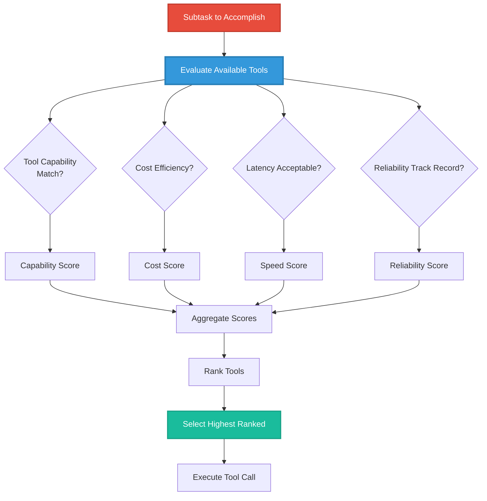

**Decision Matrix Example**:

| Tool | Capability | Cost | Speed | Reliability | Total Score |
|------|-----------|------|-------|-------------|-------------|
| API_A | 10/10 | 6/10 | 8/10 | 9/10 | 33/40 |
| API_B | 8/10 | 9/10 | 9/10 | 7/10 | 33/40 |
| API_C | 9/10 | 8/10 | 6/10 | 10/10 | 33/40 |

In this case, the agent might choose API_B for cost-sensitive tasks, API_C for reliability-critical tasks, or API_A for capability-demanding tasks.

**Strategies**:
- **Greedy Selection**: Choose best single tool
- **Ensemble**: Use multiple tools, combine results
- **Sequential**: Try tools in priority order until success
- **Learned Selection**: Use historical performance data

---

## Safety & Governance

### Guardrails

**Definition**: Constraints and validation mechanisms that prevent agents from taking harmful, unethical, or unintended actions, ensuring outputs align with safety and policy requirements.

**Guardrail Types**:

```mermaid
graph TD
    GR[Guardrails]
    
    GR --> Input[Input Guardrails]
    Input --> I1[Prompt Injection Detection<br/>Malicious Input Filtering]
    Input --> I2[PII Detection<br/>Sensitive Data Blocking]
    Input --> I3[Toxic Content Filter<br/>Abuse Prevention]
    
    GR --> Process[Process Guardrails]
    Process --> P1[Budget Limits<br/>Cost Controls]
    Process --> P2[Rate Limiting<br/>Quota Management]
    Process --> P3[Timeout Controls<br/>Runaway Prevention]
    
    GR --> Output[Output Guardrails]
    Output --> O1[Hallucination Detection<br/>Factuality Checking]
    Output --> O2[Bias Detection<br/>Fairness Validation]
    Output --> O3[Safety Classification<br/>Harmful Content Blocking]
    
    GR --> Action[Action Guardrails]
    Action --> A1[Approval Workflows<br/>Human-in-the-Loop]
    Action --> A2[Sandboxing<br/>Restricted Execution]
    Action --> A3[Rollback Capability<br/>Undo Mechanisms]
    
    style GR fill:#E74C3C,stroke:#C0392B,stroke-width:3px,color:#fff
    style Input fill:#3498DB,stroke:#2980B9,stroke-width:2px,color:#fff
    style Process fill:#9B59B6,stroke:#8E44AD,stroke-width:2px,color:#fff
    style Output fill:#1ABC9C,stroke:#16A085,stroke-width:2px,color:#fff
    style Action fill:#F39C12,stroke:#E67E22,stroke-width:2px,color:#fff
```

**Implementation Layers**:

```
┌─────────────────────────────────────────────────┐
│            USER INPUT                           │
└───────────────────┬─────────────────────────────┘
                    │
        ┌───────────▼──────────┐
        │  INPUT GUARDRAILS    │
        │  • Injection detect  │
        │  • PII redaction     │
        │  • Content filter    │
        └───────────┬──────────┘
                    │
        ┌───────────▼──────────┐
        │  AGENT PROCESSING    │
        │  • Planning          │
        │  • Tool selection    │
        │  • Execution         │
        └───────────┬──────────┘
                    │
        ┌───────────▼──────────┐
        │  PROCESS GUARDRAILS  │
        │  • Budget check      │
        │  • Rate limit        │
        │  • Timeout monitor   │
        └───────────┬──────────┘
                    │
        ┌───────────▼──────────┐
        │  AGENT OUTPUT        │
        └───────────┬──────────┘
                    │
        ┌───────────▼──────────┐
        │  OUTPUT GUARDRAILS   │
        │  • Factuality check  │
        │  • Bias detection    │
        │  • Safety filter     │
        └───────────┬──────────┘
                    │
        ┌───────────▼──────────┐
        │  ACTION GUARDRAILS   │
        │  • Approval if needed│
        │  • Sandbox execution │
        │  • Log for audit     │
        └───────────┬──────────┘
                    │
┌───────────────────▼─────────────────────────────┐
│            FINAL OUTPUT TO USER                 │
└─────────────────────────────────────────────────┘
```

**Example Policies**:
- "Never execute financial transactions above $1000 without approval"
- "Block any output containing PII (SSN, credit card numbers)"
- "Refuse to generate code that could be used for hacking"
- "Maximum 100 API calls per user session"

---

### Human-in-the-Loop (HITL)

**Definition**: A pattern where human judgment and approval are integrated into the agent workflow at critical decision points, combining automation with human oversight.

**HITL Integration Points**:

```mermaid
sequenceDiagram
    participant U as User
    participant A as Agent
    participant H as Human Reviewer
    participant S as System
    
    U->>A: Request Task
    A->>A: Plan & Execute
    
    A->>A: Generate Proposal
    
    Note over A: Critical Decision Point
    
    A->>H: Request Approval<br/>"Propose to delete 500 records"
    
    H->>H: Review Proposal<br/>Assess Risk
    
    alt Approved
        H->>A: Approve
        A->>S: Execute Action
        S-->>A: Confirmation
        A-->>U: Task Complete
    else Rejected
        H->>A: Reject + Feedback
        A->>A: Revise Approach
        A->>H: New Proposal
    else Modified
        H->>A: Approve with Changes<br/>"Only delete 50 records"
        A->>S: Execute Modified Action
        S-->>A: Confirmation
        A-->>U: Task Complete (modified)
    end
    
    style A fill:#3498DB,stroke:#2980B9,stroke-width:2px,color:#fff
    style H fill:#E74C3C,stroke:#C0392B,stroke-width:2px,color:#fff
```

**HITL Trigger Conditions**:
- High-stakes decisions (financial, legal, safety-critical)
- Uncertain confidence (agent expresses low certainty)
- Novel situations (outside training distribution)
- Policy requirements (regulatory compliance)
- User preference (user opts for oversight)

**Benefits**:
- Risk mitigation for critical operations
- Maintains human accountability
- Builds user trust through transparency
- Enables learning from human corrections

**Challenges**:
- Latency introduced by human wait time
- Scalability limited by human availability
- Potential for approval fatigue
- Consistency across different reviewers

---

### Audit Trail

**Definition**: Comprehensive logging of agent actions, decisions, tool calls, and reasoning processes to enable accountability, debugging, compliance, and post-hoc analysis.

**Audit Trail Components**:

```mermaid
graph TD
    AT[Audit Trail]
    
    AT --> Session[Session Metadata]
    Session --> S1[User ID]
    Session --> S2[Timestamp]
    Session --> S3[Agent Version]
    Session --> S4[Configuration]
    
    AT --> Input[Input Logging]
    Input --> IN1[User Query]
    Input --> IN2[Context Provided]
    Input --> IN3[Files Uploaded]
    
    AT --> Process[Process Logging]
    Process --> PR1[Reasoning Steps<br/>Chain-of-Thought]
    Process --> PR2[Tool Calls<br/>Parameters & Results]
    Process --> PR3[Errors & Retries]
    Process --> PR4[Decision Points]
    
    AT --> Output[Output Logging]
    Output --> OU1[Generated Response]
    Output --> OU2[Actions Taken]
    Output --> OU3[Files Created]
    
    AT --> Metrics[Performance Metrics]
    Metrics --> M1[Latency]
    Metrics --> M2[Token Usage]
    Metrics --> M3[Cost]
    Metrics --> M4[Success/Failure]
    
    style AT fill:#E74C3C,stroke:#C0392B,stroke-width:3px,color:#fff
    style Session fill:#3498DB,stroke:#2980B9,stroke-width:2px,color:#fff
    style Input fill:#9B59B6,stroke:#8E44AD,stroke-width:2px,color:#fff
    style Process fill:#1ABC9C,stroke:#16A085,stroke-width:2px,color:#fff
    style Output fill:#F39C12,stroke:#E67E22,stroke-width:2px,color:#fff
    style Metrics fill:#95A5A6,stroke:#7F8C8D,stroke-width:2px,color:#fff
```

**Sample Audit Log Entry**:
```json
{
  "session_id": "sess_abc123",
  "timestamp": "2025-01-17T10:30:45Z",
  "user_id": "user_789",
  "agent_version": "v2.3.1",
  
  "input": {
    "query": "Analyze Q4 sales data and identify trends",
    "context": "previous_conversation_summary",
    "files": ["sales_q4_2024.csv"]
  },
  
  "reasoning": [
    {
      "step": 1,
      "thought": "I need to load and parse the sales data file",
      "action": "call tool: read_csv",
      "parameters": {"file": "sales_q4_2024.csv"},
      "result": "Success: 1500 rows loaded",
      "duration_ms": 234
    },
    {
      "step": 2,
      "thought": "Calculate monthly aggregates to identify trends",
      "action": "call tool: aggregate_data",
      "parameters": {"group_by": "month", "metric": "revenue"},
      "result": "Success: 3 monthly totals calculated",
      "duration_ms": 89
    }
  ],
  
  "output": {
    "response": "Analysis shows 15% revenue growth in Q4...",
    "confidence": 0.92,
    "citations": ["sales_q4_2024.csv:rows_100-500"]
  },
  
  "metrics": {
    "total_latency_ms": 3456,
    "llm_calls": 3,
    "tokens_used": 2340,
    "cost_usd": 0.047,
    "success": true
  }
}
```

**Compliance Use Cases**:
- **GDPR**: Demonstrate data processing purposes and user consent
- **SOX**: Audit financial reporting agent decisions
- **HIPAA**: Track access to protected health information
- **FDA**: Document AI-assisted medical device decisions

---

## Evaluation & Testing

### Benchmarking

**Definition**: Systematic measurement of agent performance against standardized test suites to assess capabilities, compare models, and track improvements over time.

**Benchmark Categories**:

```mermaid
graph TD
    Bench[Agent Benchmarks]
    
    Bench --> Task[Task-Specific]
    Task --> T1[WebShop<br/>E-commerce Navigation]
    Task --> T2[HotpotQA<br/>Multi-Hop Reasoning]
    Task --> T3[SWE-bench<br/>Software Engineering]
    
    Bench --> Gen[General Capability]
    Gen --> G1[MMLU<br/>Knowledge & Reasoning]
    Gen --> G2[BIG-Bench<br/>Diverse Tasks]
    Gen --> G3[HumanEval<br/>Code Generation]
    
    Bench --> Agent[Agentic Capability]
    Agent --> A1[AgentBench<br/>Multi-Domain Agent Tasks]
    Agent --> A2[ToolBench<br/>Tool Usage Proficiency]
    Agent --> A3[WebArena<br/>Web Navigation]
    
    Bench --> Safe[Safety & Alignment]
    Safe --> S1[TruthfulQA<br/>Factuality]
    Safe --> S2[BBQ<br/>Bias Detection]
    Safe --> S3[AdvBench<br/>Adversarial Robustness]
    
    style Bench fill:#E74C3C,stroke:#C0392B,stroke-width:3px,color:#fff
    style Task fill:#3498DB,stroke:#2980B9,stroke-width:2px,color:#fff
    style Gen fill:#9B59B6,stroke:#8E44AD,stroke-width:2px,color:#fff
    style Agent fill:#1ABC9C,stroke:#16A085,stroke-width:2px,color:#fff
    style Safe fill:#F39C12,stroke:#E67E22,stroke-width:2px,color:#fff
```

**Evaluation Metrics**:

| Metric | Definition | Example |
|--------|-----------|---------|
| **Success Rate** | % of tasks completed correctly | 87% of queries answered |
| **Efficiency** | Resources used per task | 1200 tokens/query avg |
| **Latency** | Time to complete task | 3.5 seconds median |
| **Accuracy** | Correctness of outputs | 92% factually correct |
| **Robustness** | Performance under adversarial inputs | 78% resilience to jailbreaks |
| **Cost** | Financial expense per task | $0.04/query |

**Custom Benchmark Creation**:
For domain-specific applications (like the Eliot ontology testing), create custom benchmarks:

1. **Define Test Cases**: Representative tasks from target domain
2. **Establish Ground Truth**: Expert-validated correct answers
3. **Specify Success Criteria**: What constitutes passing
4. **Automate Execution**: Scripts to run tests at scale
5. **Track Over Time**: Monitor regression/improvement

---

### A/B Testing

**Definition**: Experimental comparison of two agent variants (A and B) by exposing them to similar user populations and measuring performance differences.

**A/B Test Framework**:

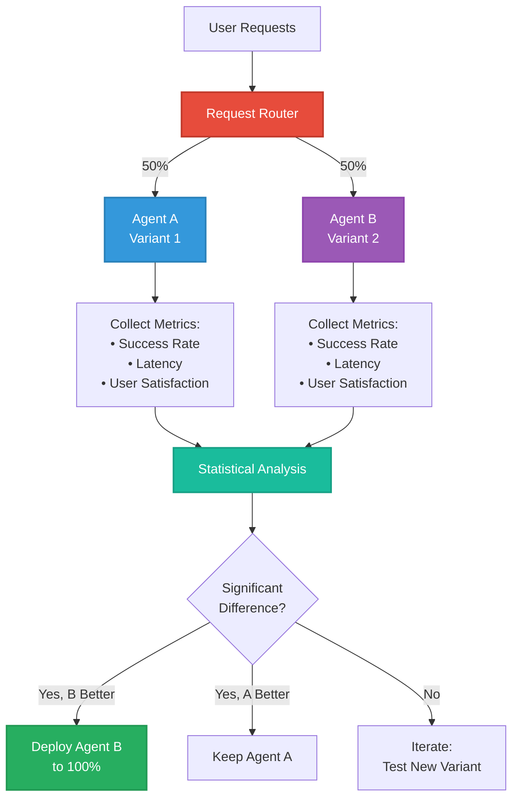

**What to Test**:
- Prompt variations
- Model selection (GPT-4 vs Claude vs Gemini)
- Temperature/sampling parameters
- Tool selection strategies
- Planning approaches

**Statistical Considerations**:
- **Sample Size**: Ensure sufficient data for significance
- **Randomization**: Avoid biased user assignment
- **Duration**: Run long enough to capture variance
- **Multiple Testing**: Correct for multiple comparisons

---

### Regression Testing

**Definition**: Automated verification that agent performance doesn't degrade when making changes to prompts, models, or system components.

**Regression Test Suite**:

```mermaid
flowchart LR
    Change[Code/Prompt Change] --> Trigger[Trigger Test Suite]
    
    Trigger --> T1[Unit Tests<br/>Individual Components]
    Trigger --> T2[Integration Tests<br/>Multi-Component Workflows]
    Trigger --> T3[End-to-End Tests<br/>Full User Scenarios]
    
    T1 --> Check1{Pass?}
    T2 --> Check2{Pass?}
    T3 --> Check3{Pass?}
    
    Check1 -->|No| Fail[Report Regression]
    Check2 -->|No| Fail
    Check3 -->|No| Fail
    
    Check1 -->|Yes| Metrics[Compare Metrics<br/>vs Baseline]
    Check2 -->|Yes| Metrics
    Check3 -->|Yes| Metrics
    
    Metrics --> Threshold{Within<br/>Tolerance?}
    
    Threshold -->|No| Fail
    Threshold -->|Yes| Pass[Tests Pass<br/>Deploy Change]
    
    style Change fill:#E74C3C,stroke:#C0392B,stroke-width:2px,color:#fff
    style Trigger fill:#3498DB,stroke:#2980B9,stroke-width:2px,color:#fff
    style Metrics fill:#9B59B6,stroke:#8E44AD,stroke-width:2px,color:#fff
    style Pass fill:#1ABC9C,stroke:#16A085,stroke-width:2px,color:#fff
    style Fail fill:#C0392B,stroke:#E74C3C,stroke-width:2px,color:#fff
```

**Test Case Structure**:
```python
test_cases = [
    {
        "id": "test_001",
        "description": "Multi-hop reasoning question",
        "input": "What is the capital of the country where the Eiffel Tower is located?",
        "expected_output": "Paris",
        "success_criteria": "exact_match",
        "baseline_latency_ms": 2500,
        "tolerance_latency_ms": 500
    },
    # ... more test cases
]
```

**Continuous Monitoring**:
- Run regression tests on every commit
- Track metrics over time (trend analysis)
- Alert on performance degradation
- Maintain historical baseline data

---

## Knowledge Representation

### Ontology

**Definition**: A formal, explicit specification of a shared conceptualization—defining entities, attributes, and relationships within a domain to enable structured knowledge representation and reasoning.

**Ontology Components**:

```mermaid
graph TD
    Onto[Ontology]
    
    Onto --> Classes[Classes<br/>Entity Types]
    Classes --> C1[LiteraryFigure]
    Classes --> C2[LiteraryWork]
    Classes --> C3[Movement]
    
    Onto --> Props[Properties<br/>Attributes & Relations]
    Props --> P1[birthDate<br/>Data Property]
    Props --> P2[influencedBy<br/>Object Property]
    
    Onto --> Inst[Instances<br/>Specific Entities]
    Inst --> I1[T.S. Eliot<br/>Instance of LiteraryFigure]
    
    Onto --> Axioms[Axioms<br/>Rules & Constraints]
    Axioms --> A1[Every Work has<br/>exactly one Author]
    Axioms --> A2[influenced is<br/>transitive]
    
    C1 --> I1
    P1 --> I1
    P2 --> I1
    
    style Onto fill:#E74C3C,stroke:#C0392B,stroke-width:3px,color:#fff
    style Classes fill:#3498DB,stroke:#2980B9,stroke-width:2px,color:#fff
    style Props fill:#9B59B6,stroke:#8E44AD,stroke-width:2px,color:#fff
    style Inst fill:#1ABC9C,stroke:#16A085,stroke-width:2px,color:#fff
    style Axioms fill:#F39C12,stroke:#E67E22,stroke-width:2px,color:#fff
```

**Example - Literary Ontology Excerpt**:
```turtle
@prefix lit: <https://literary-ontology.org/> .
@prefix schema: <https://schema.org/> .

lit:LiteraryFigure a rdfs:Class ;
    rdfs:subClassOf schema:Person ;
    rdfs:label "Literary Figure" .

lit:influencedBy a rdf:Property ;
    rdfs:domain lit:LiteraryFigure ;
    rdfs:range lit:LiteraryFigure ;
    rdfs:label "influenced by" .

lit:TSEliot a lit:LiteraryFigure ;
    schema:name "T.S. Eliot" ;
    schema:birthDate "1888-09-26" ;
    lit:influencedBy lit:DanteAlighieri .
```

**Benefits for AI/Agentic Systems**:
- **Structured Reasoning**: Agents can query relationships logically
- **Consistency**: Enforced constraints prevent invalid data
- **Interoperability**: Shared vocabulary enables integration
- **Inference**: Derive implicit knowledge from explicit facts

---

### Knowledge Graph

**Definition**: A graph-structured knowledge base where entities (nodes) and their relationships (edges) represent interconnected information, enabling semantic querying and reasoning.

**Knowledge Graph Structure**:

```mermaid
graph LR
    TSE[T.S. Eliot<br/>Person] -->|wrote| WL[The Waste Land<br/>Poem]
    TSE -->|influencedBy| Dante[Dante Alighieri<br/>Person]
    TSE -->|studied_at| Harvard[Harvard University<br/>Institution]
    TSE -->|influenced| Lowell[Robert Lowell<br/>Person]
    
    WL -->|explores| Concept1[Spiritual Drought<br/>Concept]
    WL -->|alludesTo| DC[Divine Comedy<br/>Poem]
    
    Dante -->|wrote| DC
    
    Harvard -->|locatedIn| Cambridge[Cambridge, MA<br/>Place]
    
    Lowell -->|associatedWith| CP[Confessional Poetry<br/>Movement]
    
    style TSE fill:#E74C3C,stroke:#C0392B,stroke-width:3px,color:#fff
    style WL fill:#3498DB,stroke:#2980B9,stroke-width:2px,color:#fff
    style Dante fill:#9B59B6,stroke:#8E44AD,stroke-width:2px,color:#fff
    style Harvard fill:#1ABC9C,stroke:#16A085,stroke-width:2px,color:#fff
    style Lowell fill:#F39C12,stroke:#E67E22,stroke-width:2px,color:#fff
```

**Query Examples** (Cypher for Neo4j):

```cypher
// Find all poets influenced by Eliot
MATCH (eliot:Person {name: 'T.S. Eliot'})-[:influenced]->(poet:Person)
RETURN poet.name

// Find influence chain from Dante to modern poets
MATCH path = (dante:Person {name: 'Dante Alighieri'})
             -[:influenced*1..3]->(modern:Person)
WHERE modern.birthDate > date('1900-01-01')
RETURN path

// Find common themes between works
MATCH (work1:Poem)-[:explores]->(concept:Concept)<-[:explores]-(work2:Poem)
WHERE work1.author = 'T.S. Eliot'
RETURN work1.name, work2.name, concept.name
```

**Use Cases**:
- **Question Answering**: "Who influenced Eliot's early work?"
- **Recommendation**: "Find poets similar to Eliot"
- **Discovery**: "What concepts appear in both modernist and contemporary poetry?"
- **Validation**: "Is this influence claim supported by evidence?"

---

### Semantic Layer

**Definition**: An abstraction layer that provides a business-friendly, unified view of underlying data sources, translating between human concepts and technical data structures.

**Semantic Layer Architecture**:

```mermaid
graph TB
    subgraph "User Layer"
        U1[Business Users]
        U2[Data Analysts]
        U3[AI Agents]
    end
    
    subgraph "Semantic Layer"
        Concepts[Business Concepts<br/>Customer, Revenue, Product]
        Metrics[Calculated Metrics<br/>LTV, Churn Rate, ARPU]
        Relations[Relationships<br/>Customer → Orders → Products]
    end
    
    subgraph "Data Layer"
        DB1[(SQL Database)]
        DB2[(Data Warehouse)]
        API[REST APIs]
        Files[File Storage]
    end
    
    U1 --> Concepts
    U2 --> Metrics
    U3 --> Relations
    
    Concepts --> Mapping[Semantic Mapping]
    Metrics --> Mapping
    Relations --> Mapping
    
    Mapping --> DB1
    Mapping --> DB2
    Mapping --> API
    Mapping --> Files
    
    style Concepts fill:#E74C3C,stroke:#C0392B,stroke-width:2px,color:#fff
    style Metrics fill:#3498DB,stroke:#2980B9,stroke-width:2px,color:#fff
    style Relations fill:#9B59B6,stroke:#8E44AD,stroke-width:2px,color:#fff
    style Mapping fill:#1ABC9C,stroke:#16A085,stroke-width:3px,color:#fff
```

**Example Mapping**:
```yaml
# Business Concept: Customer Lifetime Value
LTV:
  definition: "Total revenue expected from a customer over their relationship"
  calculation: "SUM(orders.revenue) / COUNT(DISTINCT customers)"
  data_sources:
    - database: "analytics_db"
      table: "orders"
      join: "customers.id = orders.customer_id"
  filters:
    - "orders.status = 'completed'"
```

**Benefits for Agentic AI**:
- **Natural Language Queries**: "What's the average LTV?" maps to complex SQL
- **Consistency**: Same metric definition across all agents
- **Abstraction**: Agents don't need to know underlying schema
- **Governance**: Centralized access control and data policies

---

## Integration Patterns

### API Integration

**Definition**: Methods and patterns for connecting agentic systems with external services, databases, and tools through Application Programming Interfaces.

**Integration Patterns**:

```mermaid
graph TD
    Agent[AI Agent]
    
    Agent --> P1[REST API<br/>HTTP Request/Response]
    Agent --> P2[GraphQL<br/>Flexible Data Queries]
    Agent --> P3[Webhook<br/>Event-Driven Callbacks]
    Agent --> P4[SDK/Library<br/>Native Code Integration]
    Agent --> P5[Database Direct<br/>SQL/NoSQL Queries]
    
    P1 --> S1[External Service A]
    P2 --> S2[External Service B]
    P3 --> S3[External Service C]
    P4 --> S4[Platform SDK]
    P5 --> DB[(Database)]
    
    style Agent fill:#E74C3C,stroke:#C0392B,stroke-width:3px,color:#fff
    style P1 fill:#3498DB,stroke:#2980B9,stroke-width:2px,color:#fff
    style P2 fill:#9B59B6,stroke:#8E44AD,stroke-width:2px,color:#fff
    style P3 fill:#1ABC9C,stroke:#16A085,stroke-width:2px,color:#fff
    style P4 fill:#F39C12,stroke:#E67E22,stroke-width:2px,color:#fff
    style P5 fill:#95A5A6,stroke:#7F8C8D,stroke-width:2px,color:#fff
```

**Error Handling Strategies**:

```mermaid
flowchart TD
    Call[API Call] --> Exec[Execute Request]
    
    Exec --> Check{Success?}
    
    Check -->|Yes| Success[Return Result]
    
    Check -->|No| Error[Error Detected]
    
    Error --> Type{Error Type?}
    
    Type -->|Transient<br/>Network, Timeout| Retry[Retry with<br/>Exponential Backoff]
    
    Type -->|Rate Limit| Wait[Wait & Retry<br/>After Delay]
    
    Type -->|Auth Error| Refresh[Refresh Token<br/>& Retry]
    
    Type -->|Permanent<br/>Invalid Input| Fail[Fail & Report<br/>to User]
    
    Retry --> Attempts{Max<br/>Attempts?}
    Attempts -->|No| Exec
    Attempts -->|Yes| Fail
    
    Wait --> Exec
    Refresh --> Exec
    
    style Call fill:#E74C3C,stroke:#C0392B,stroke-width:2px,color:#fff
    style Success fill:#1ABC9C,stroke:#16A085,stroke-width:2px,color:#fff
    style Fail fill:#C0392B,stroke:#E74C3C,stroke-width:2px,color:#fff
```

**Best Practices**:
- **Authentication**: Secure credential management (never in code)
- **Rate Limiting**: Respect API quotas, implement backoff
- **Timeout**: Set reasonable timeouts to prevent hanging
- **Idempotency**: Ensure retry safety for non-idempotent operations
- **Logging**: Record all API interactions for debugging

---

### Event-Driven Architecture

**Definition**: A system design where components communicate through events (state changes or notifications), enabling loose coupling and asynchronous processing.

**Event Flow**:

```mermaid
sequenceDiagram
    participant U as User Action
    participant P as Publisher<br/>(Agent/Service)
    participant B as Event Bus<br/>(Message Queue)
    participant S1 as Subscriber 1<br/>(Analytics Agent)
    participant S2 as Subscriber 2<br/>(Notification Agent)
    participant S3 as Subscriber 3<br/>(Logging Service)
    
    U->>P: Trigger Action<br/>(e.g., Order Placed)
    
    P->>P: Process Action
    
    P->>B: Publish Event<br/>{type: "order.placed", data: {...}}
    
    B->>S1: Deliver Event
    B->>S2: Deliver Event
    B->>S3: Deliver Event
    
    S1->>S1: Update Analytics
    S2->>S2: Send Confirmation
    S3->>S3: Log Transaction
    
    S1-->>B: Ack
    S2-->>B: Ack
    S3-->>B: Ack
    
    style P fill:#E74C3C,stroke:#C0392B,stroke-width:2px,color:#fff
    style B fill:#3498DB,stroke:#2980B9,stroke-width:3px,color:#fff
    style S1 fill:#1ABC9C,stroke:#16A085,stroke-width:2px,color:#fff
    style S2 fill:#9B59B6,stroke:#8E44AD,stroke-width:2px,color:#fff
    style S3 fill:#F39C12,stroke:#E67E22,stroke-width:2px,color:#fff
```

**Event Types**:
- **Domain Events**: Business-meaningful state changes (order placed, user registered)
- **System Events**: Technical occurrences (service started, error detected)
- **Command Events**: Instructions for action (send email, update database)

**Benefits for Agentic Systems**:
- **Scalability**: Agents can subscribe to relevant events only
- **Resilience**: Failure of one agent doesn't block others
- **Flexibility**: Add new agents without modifying existing ones
- **Auditability**: Event logs provide complete history

---

## Business & Strategy

### Competitive Advantage

**Definition**: In the context of agentic AI, sustainable differentiation achieved through superior agent capabilities, proprietary data, domain expertise, or operational excellence that competitors cannot easily replicate.

**Sources of Advantage**:

```mermaid
graph TD
    CA[Competitive Advantage<br/>in Agentic AI]
    
    CA --> Data[Proprietary Data]
    Data --> D1[Unique Training Data<br/>Industry-Specific Corpus]
    Data --> D2[Exclusive Access<br/>Partner Data]
    Data --> D3[First-Party Data<br/>User Interactions]
    
    CA --> Expertise[Domain Expertise]
    Expertise --> E1[Deep Domain Knowledge<br/>Encoded in Prompts]
    Expertise --> E2[Specialized Tools<br/>Custom Integrations]
    Expertise --> E3[Expert Validation<br/>Human-in-the-Loop]
    
    CA --> Tech[Technical Excellence]
    Tech --> T1[Advanced Harness<br/>Superior Safety/Reliability]
    Tech --> T2[Optimized Performance<br/>Lower Cost, Higher Speed]
    Tech --> T3[Novel Architectures<br/>Proprietary Agent Design]
    
    CA --> Network[Network Effects]
    Network --> N1[Usage Data Flywheel<br/>More Users → Better Model]
    Network --> N2[Integration Ecosystem<br/>Partners & Tools]
    
    style CA fill:#E74C3C,stroke:#C0392B,stroke-width:3px,color:#fff
    style Data fill:#3498DB,stroke:#2980B9,stroke-width:2px,color:#fff
    style Expertise fill:#9B59B6,stroke:#8E44AD,stroke-width:2px,color:#fff
    style Tech fill:#1ABC9C,stroke:#16A085,stroke-width:2px,color:#fff
    style Network fill:#F39C12,stroke:#E67E22,stroke-width:2px,color:#fff
```

**Beyond Obvious Use Cases**:
Most agentic AI implementations focus on obvious automation (chatbots, summarization). Sustainable advantage comes from:
- **Complex Workflows**: Multi-agent orchestration for high-value processes
- **Proprietary Integration**: Agents deeply embedded in unique business systems
- **Compound AI Systems**: Combining retrieval, reasoning, and specialized models
- **Continuous Learning**: Agents that improve from domain-specific feedback

**Defensibility Matrix**:

| Advantage Source | Easy to Copy | Hard to Copy |
|-----------------|--------------|--------------|
| **Off-the-shelf LLM** | ✓ (GPT-4, Claude available to all) | |
| **Basic RAG** | ✓ (Standard pattern) | |
| **Custom Tools** | | ✓ (Requires integration work) |
| **Domain Ontology** | | ✓ (Years of knowledge engineering) |
| **Specialized Data** | | ✓ (Proprietary sources) |
| **Production Harness** | | ✓ (Operational excellence) |
| **Multi-Agent Systems** | | ✓ (Coordination complexity) |

---

### ROI Metrics

**Definition**: Quantifiable measures for assessing the return on investment in agentic AI implementations, balancing costs against business value delivered.

**Cost Components**:

```mermaid
graph TD
    Costs[Total Cost of Ownership]
    
    Costs --> Dev[Development Costs]
    Dev --> D1[Engineering Time<br/>Agent Design & Build]
    Dev --> D2[Data Preparation<br/>Knowledge Base Creation]
    Dev --> D3[Integration Work<br/>Tool & API Connections]
    
    Costs --> Ops[Operational Costs]
    Ops --> O1[LLM API Costs<br/>Token Usage Fees]
    Ops --> O2[Infrastructure<br/>Compute, Storage]
    Ops --> O3[Monitoring<br/>Observability Tools]
    
    Costs --> Maint[Maintenance Costs]
    Maint --> M1[Prompt Tuning<br/>Continuous Optimization]
    Maint --> M2[Knowledge Updates<br/>Data Refresh]
    Maint --> M3[Model Upgrades<br/>Migration Work]
    
    Costs --> Gov[Governance Costs]
    Gov --> G1[Human Review<br/>HITL Labor]
    Gov --> G2[Compliance<br/>Audit & Reporting]
    Gov --> G3[Safety Testing<br/>Red Teaming]
    
    style Costs fill:#E74C3C,stroke:#C0392B,stroke-width:3px,color:#fff
    style Dev fill:#3498DB,stroke:#2980B9,stroke-width:2px,color:#fff
    style Ops fill:#9B59B6,stroke:#8E44AD,stroke-width:2px,color:#fff
    style Maint fill:#1ABC9C,stroke:#16A085,stroke-width:2px,color:#fff
    style Gov fill:#F39C12,stroke:#E67E22,stroke-width:2px,color:#fff
```

**Value Metrics**:

```mermaid
graph TD
    Value[Business Value]
    
    Value --> Eff[Efficiency Gains]
    Eff --> E1[Time Savings<br/>Hours Automated]
    Eff --> E2[Cost Reduction<br/>Labor Displacement]
    Eff --> E3[Throughput Increase<br/>Volume Handled]
    
    Value --> Qual[Quality Improvements]
    Qual --> Q1[Error Reduction<br/>Fewer Mistakes]
    Qual --> Q2[Consistency<br/>Standardized Outputs]
    Qual --> Q3[Compliance<br/>Reduced Violations]
    
    Value --> Rev[Revenue Impact]
    Rev --> R1[Customer Satisfaction<br/>Retention Improvement]
    Rev --> R2[New Capabilities<br/>Offerings Enabled]
    Rev --> R3[Market Expansion<br/>Scale Previously Impossible]
    
    Value --> Strat[Strategic Value]
    Strat --> S1[Competitive Position<br/>Differentiation]
    Strat --> S2[Innovation Velocity<br/>Faster Experimentation]
    Strat --> S3[Data Flywheel<br/>Learning from Usage]
    
    style Value fill:#1ABC9C,stroke:#16A085,stroke-width:3px,color:#fff
    style Eff fill:#3498DB,stroke:#2980B9,stroke-width:2px,color:#fff
    style Qual fill:#9B59B6,stroke:#8E44AD,stroke-width:2px,color:#fff
    style Rev fill:#F39C12,stroke:#E67E22,stroke-width:2px,color:#fff
    style Strat fill:#E74C3C,stroke:#C0392B,stroke-width:2px,color:#fff
```

**ROI Calculation Framework**:
```
ROI = (Total Value - Total Cost) / Total Cost × 100%

Example:
Annual Value = $500K (time savings) + $200K (quality improvement)
Annual Cost = $150K (LLM) + $100K (engineering) + $50K (ops)
ROI = ($700K - $300K) / $300K = 133%
```

**Measurement Horizons**:
- **Immediate** (0-3 months): Pilot metrics, initial efficiency
- **Short-term** (3-12 months): Production deployment, cost savings
- **Medium-term** (1-2 years): Quality improvements, user adoption
- **Long-term** (2+ years): Strategic value, competitive advantage

---

### Use Case Prioritization

**Definition**: Framework for selecting which agentic AI applications to pursue based on business value, technical feasibility, and strategic alignment.

**Prioritization Matrix**:

```mermaid
quadrantChart
    title Use Case Prioritization
    x-axis Low Technical Complexity --> High Technical Complexity
    y-axis Low Business Value --> High Business Value
    quadrant-1 Strategic Investments
    quadrant-2 Quick Wins
    quadrant-3 Avoid
    quadrant-4 Reconsider
    
    Customer Service Bot: [0.3, 0.6]
    Document Summarization: [0.2, 0.5]
    Basic Data Entry: [0.1, 0.3]
    
    Complex Workflow Automation: [0.7, 0.9]
    Multi-Agent Research: [0.8, 0.85]
    Specialized Ontology: [0.75, 0.8]
    
    Advanced Reasoning: [0.9, 0.5]
    Novel Architecture: [0.95, 0.4]
    
    Simple Chatbot: [0.15, 0.2]
    Template Generation: [0.2, 0.25]
```

**Evaluation Criteria**:

| Criterion | Questions to Ask |
|-----------|------------------|
| **Business Value** | • Revenue impact? <br>• Cost savings? <br>• Strategic importance? |
| **Technical Feasibility** | • Data availability? <br>• Integration complexity? <br>• Required expertise? |
| **User Readiness** | • Change management needs? <br>• Trust building required? <br>• Training overhead? |
| **Competitive Urgency** | • Are competitors doing this? <br>• Is this differentiating? <br>• Window of opportunity? |
| **Risk Profile** | • What if it fails? <br>• Regulatory concerns? <br>• Reputational exposure? |

**Prioritization Framework**:

```mermaid
flowchart TD
    Start[Use Case Proposal]
    
    Start --> Q1{High Business<br/>Value?}
    
    Q1 -->|No| Reject[Reject or<br/>Defer]
    
    Q1 -->|Yes| Q2{Technically<br/>Feasible?}
    
    Q2 -->|No| Research[Research<br/>Phase]
    
    Q2 -->|Yes| Q3{Low Risk?}
    
    Q3 -->|No| Pilot[Pilot with<br/>Guardrails]
    
    Q3 -->|Yes| Q4{Quick<br/>Implementation?}
    
    Q4 -->|Yes| Priority1[P1: Quick Win<br/>Implement Now]
    
    Q4 -->|No| Q5{Strategic<br/>Importance?}
    
    Q5 -->|Yes| Priority2[P2: Strategic<br/>Plan & Resource]
    
    Q5 -->|No| Priority3[P3: Backlog<br/>Monitor & Revisit]
    
    style Priority1 fill:#1ABC9C,stroke:#16A085,stroke-width:3px,color:#fff
    style Priority2 fill:#3498DB,stroke:#2980B9,stroke-width:2px,color:#fff
    style Priority3 fill:#F39C12,stroke:#E67E22,stroke-width:2px,color:#fff
    style Reject fill:#C0392B,stroke:#E74C3C,stroke-width:2px,color:#fff
```

---

## Glossary Quick Reference

**Agent**: AI system with autonomous goal-directed behavior  
**Agentic AI**: LLM-based systems augmented with tools, memory, planning  
**Harness**: Orchestration framework providing infrastructure, guardrails, coordination  
**Multi-Agent System**: Multiple specialized agents working collaboratively  
**Tool Calling**: LLM invoking external functions/APIs  
**ReAct**: Reasoning + Acting pattern with observable thought chains  
**Chain-of-Thought**: Breaking problems into step-by-step reasoning  
**RAG**: Retrieval-Augmented Generation for grounded responses  
**Prompt Engineering**: Optimizing LLM inputs for desired outputs  
**Context Window**: Maximum tokens LLM can process  
**Planning**: Decomposing goals into actionable subtasks  
**Memory**: Agent's capacity to store and use past information  
**Reflection**: Agent evaluating own performance and adjusting  
**Tool Selection**: Choosing appropriate tools for subtasks  
**Guardrails**: Safety constraints preventing harmful actions  
**HITL**: Human-in-the-Loop approval workflows  
**Audit Trail**: Comprehensive logging for accountability  
**Benchmarking**: Systematic performance measurement  
**A/B Testing**: Experimental comparison of variants  
**Regression Testing**: Verifying no performance degradation  
**Ontology**: Formal specification of domain knowledge  
**Knowledge Graph**: Graph-structured knowledge base  
**Semantic Layer**: Business-friendly data abstraction  
**API Integration**: Connecting with external services  
**Event-Driven**: Asynchronous communication via events  
**Competitive Advantage**: Sustainable differentiation  
**ROI Metrics**: Quantifying return on investment  
**Use Case Prioritization**: Selecting applications strategically  

---

## Version History

**Version 2.0** (January 2025)
- Added comprehensive Harness definition with diagrams
- Expanded all entries with Mermaid diagrams
- Added ASCII diagrams for key concepts
- Included business strategy section
- Enhanced with detailed explanatory text
- Structured by category for easier navigation

**Version 1.0** (December 2024)
- Initial glossary with core agentic concepts

---

## References & Further Reading

**Frameworks & Tools**:
- LangChain: https://langchain.com
- LlamaIndex: https://llamaindex.ai
- AWS Bedrock: https://aws.amazon.com/bedrock
- Azure AI: https://azure.microsoft.com/en-us/solutions/ai

**Research Papers**:
- ReAct: Reasoning and Acting (Yao et al., 2022)
- Chain-of-Thought Prompting (Wei et al., 2022)
- Reflexion: Language Agents with Verbal Reinforcement Learning (Shinn et al., 2023)

**Benchmarks**:
- AgentBench: https://github.com/THUDM/AgentBench
- WebArena: https://webarena.dev
- SWE-bench: https://www.swebench.com

---

**Document Maintained By**: AI/Agentic Consulting Practice  
**Last Review**: January 17, 2025  
**Next Review**: April 2025
