# T.S. Eliot Ontology: Mermaid Diagram Visualizations

## Introduction

This document provides a comprehensive set of Mermaid diagrams visualizing different aspects of the T.S. Eliot Literary Lineage and Influence Ontology. Each diagram is accompanied by explanatory text describing what it represents and how it relates to the overall knowledge structure.

---

## 1. Core Ontology Class Structure

### Explanation

This diagram shows the ten fundamental classes that form the backbone of the Eliot ontology. Each class represents a distinct type of entity that can be instantiated in the knowledge graph. The hierarchical structure shows how these classes relate to Schema.org base types (Person, CreativeWork, Thing) while extending them with literary-specific properties. These classes work together to capture not just entities (people, works, concepts) but also the relationships between them (influences, interpretations, affiliations) and their contexts (geographic, temporal, institutional).

Understanding this class structure is essential for populating the knowledge graph correctly, as it defines what types of entities can be created and what properties they can possess. The design balances generality (to enable broad application) with domain specificity (to capture literary nuances).

```mermaid
graph TD
    A["Eliot Ontology<br/>Core Classes"]
    
    A --> B["LiteraryFigure<br/>(extends Person)"]
    A --> C["LiteraryWork<br/>(extends CreativeWork)"]
    A --> D["LiteraryMovement"]
    A --> E["IntellectualConcept<br/>(extends Thing)"]
    A --> F["InstitutionalAffiliation<br/>(extends OrganizationRole)"]
    A --> G["InfluenceRelationship"]
    A --> H["CriticalInterpretation<br/>(extends Review)"]
    A --> I["PublicationEvent"]
    A --> J["GeographicContext<br/>(extends Place)"]
    A --> K["TemporalPeriod"]
    
    style A fill:#2C3E50,stroke:#34495E,stroke-width:3px,color:#ECF0F1
    style B fill:#3498DB,stroke:#2980B9,stroke-width:2px,color:#fff
    style C fill:#3498DB,stroke:#2980B9,stroke-width:2px,color:#fff
    style D fill:#9B59B6,stroke:#8E44AD,stroke-width:2px,color:#fff
    style E fill:#E74C3C,stroke:#C0392B,stroke-width:2px,color:#fff
    style F fill:#1ABC9C,stroke:#16A085,stroke-width:2px,color:#fff
    style G fill:#F39C12,stroke:#E67E22,stroke-width:2px,color:#fff
    style H fill:#95A5A6,stroke:#7F8C8D,stroke-width:2px,color:#fff
    style I fill:#E67E22,stroke:#D35400,stroke-width:2px,color:#fff
    style J fill:#27AE60,stroke:#229954,stroke-width:2px,color:#fff
    style K fill:#34495E,stroke:#2C3E50,stroke-width:2px,color:#fff
```

---

## 2. LiteraryFigure Properties and Relationships

### Explanation

This diagram details the LiteraryFigure class, which is central to the ontology as it represents poets, critics, scholars, and editors in Eliot's network. The class extends Schema.org's Person type and adds literary-specific properties like associated movements, intellectual concerns, and professional roles. The relationship types shown (influenced_by, influenced, wrote, studied_at, etc.) are the edges that connect literary figures to other entities in the graph.

This structure enables the ontology to capture not just biographical facts (birth date, nationality, education) but the intellectual and creative dimensions that matter for literary analysis: what movements a figure participated in, what concepts they explored, how they influenced and were influenced by others. For Eliot specifically, this means we can represent his dual identity as American-born and British-naturalized, his evolution from student to editor to cultural authority, and his complex web of influences received from figures across centuries and traditions.

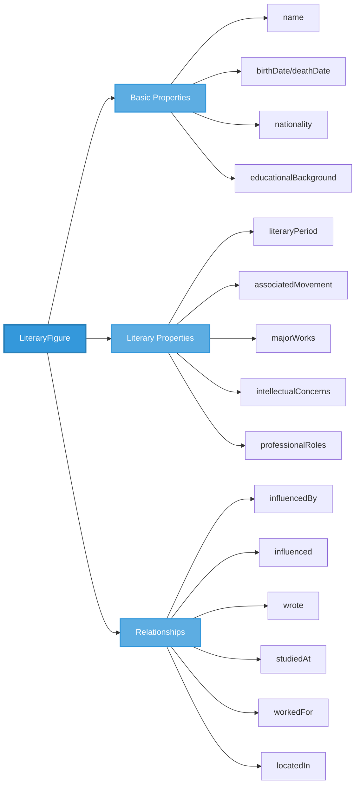

---

## 3. T.S. Eliot's Six Life Phases Timeline

### Explanation

This Gantt chart visualizes the six distinct phases of Eliot's life and career, providing temporal structure to the knowledge graph. Each phase has distinct geographic centers, intellectual preoccupations, and influence networks. The Formative Years (1888-1914) span his American education at Harvard, exposure to French Symbolism in Paris, and philosophy studies at Oxford. The Modernist Establishment phase (1914-1927) marks his arrival in London, collaboration with Pound, and creation of The Waste Land. The Religious Turn (1927-1943) follows his conversion to Anglo-Catholicism and culminates in Four Quartets.

Understanding these phases is crucial for accurate knowledge graph population because Eliot's influences, relationships, and concerns evolved dramatically over time. A relationship categorized as "1910-1915" versus "1940-1965" has very different meaning. This temporal granularity also enables sophisticated queries like "What concepts did Eliot explore in his religious phase that weren't present earlier?" or "How did his influence on younger poets differ across periods?"

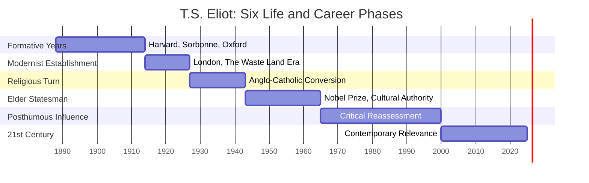

---

## 4. Influence Network: Core Relationships

### Explanation

This diagram maps the primary influence relationships flowing into and out from T.S. Eliot, showing him as a node in a vast network of literary transmission across centuries. On the left, we see major influences Eliot absorbed: Dante's spiritual vision and structural sophistication, the French Symbolists' (Baudelaire, Laforgue) urban alienation and ironic tone, the Metaphysical poets' (Donne) unified sensibility, and Pound's modernist techniques and editorial guidance. On the right, we see Eliot's influence radiating outward to mid-century poets like Lowell and Berryman, late-century figures like Heaney and Hill, and contemporary poets like Carson.

This structure is foundational to the ontology because influence is not merely a binary relationship but a documented pathway with specific characteristics: type (stylistic, thematic, philosophical), strength (foundational, major, moderate), evidence sources (letters, critical essays, textual analysis), and manifestation (how the influence actually appears in works). By modeling influence as a first-class entity (InfluenceRelationship) rather than just an edge, we can capture this rich detail and enable queries like "Show me all foundational influences on Eliot that are thematic in nature" or "Trace stylistic influences from Laforgue through Eliot to contemporary poetry."

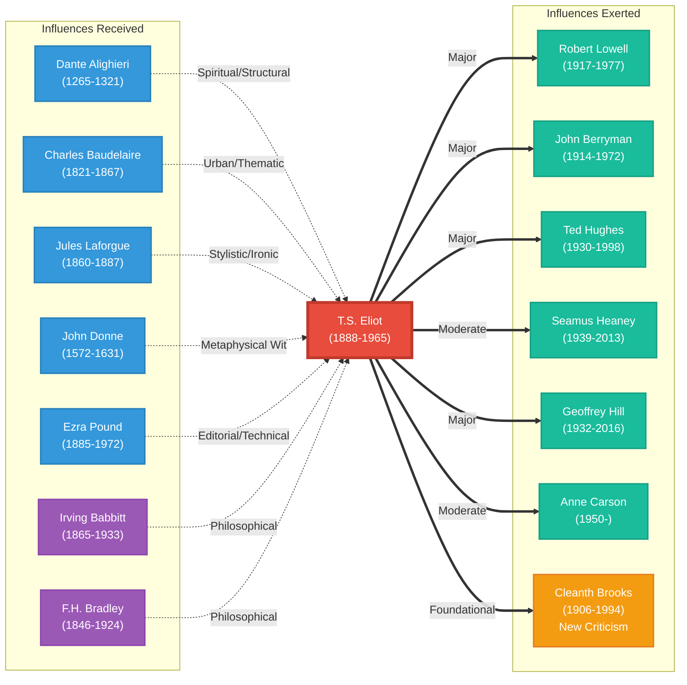

---

## 5. Eliot's Major Works and Their Themes

### Explanation

This diagram connects Eliot's major literary works to the intellectual concepts they explore, revealing thematic continuities and evolution across his career. Early works like Prufrock and The Waste Land are dominated by Modern Alienation, Fragmentation, and Spiritual Drought—the existential crisis of post-WWI modernity. The middle period (Ash-Wednesday) marks the transition toward religious concerns. The late masterwork Four Quartets synthesizes mystical Christianity with philosophical meditation on Time and Eternity, Redemption Through Suffering, and the Via Negativa.

This many-to-many relationship structure (works can explore multiple concepts; concepts can appear in multiple works) enables the ontology to capture thematic patterns that would be invisible in simpler models. It supports queries like "Which works share the theme of Time and Eternity?" or "How did Eliot's treatment of redemption evolve from The Waste Land to Four Quartets?" For your LLM testing purposes, this structure provides a framework for evaluating whether AI systems can identify not just surface themes but the deeper conceptual continuities and transformations across a body of work.

```mermaid
graph TD
    subgraph "Major Works"
        W1["The Love Song of<br/>J. Alfred Prufrock<br/>(1915)"]
        W2["The Waste Land<br/>(1922)"]
        W3["The Hollow Men<br/>(1925)"]
        W4["Ash-Wednesday<br/>(1930)"]
        W5["Four Quartets<br/>(1943)"]
        W6["Murder in the Cathedral<br/>(1935)"]
    end
    
    subgraph "Intellectual Concepts"
        C1["Modern Alienation"]
        C2["Spiritual Drought"]
        C3["Cultural Fragmentation"]
        C4["Time and Eternity"]
        C5["Redemption Through<br/>Suffering"]
        C6["Via Negativa"]
        C7["Death and Rebirth"]
        C8["Self-Consciousness<br/>& Paralysis"]
        C9["Mystical Union"]
    end
    
    W1 --> C1
    W1 --> C8
    
    W2 --> C1
    W2 --> C2
    W2 --> C3
    W2 --> C7
    
    W3 --> C2
    W3 --> C3
    
    W4 --> C5
    W4 --> C6
    W4 --> C7
    
    W5 --> C4
    W5 --> C5
    W5 --> C6
    W5 --> C9
    
    W6 --> C5
    W6 --> C7
    
    style W1 fill:#3498DB,stroke:#2980B9,stroke-width:2px,color:#fff
    style W2 fill:#E74C3C,stroke:#C0392B,stroke-width:3px,color:#fff
    style W3 fill:#3498DB,stroke:#2980B9,stroke-width:2px,color:#fff
    style W4 fill:#9B59B6,stroke:#8E44AD,stroke-width:2px,color:#fff
    style W5 fill:#9B59B6,stroke:#8E44AD,stroke-width:3px,color:#fff
    style W6 fill:#9B59B6,stroke:#8E44AD,stroke-width:2px,color:#fff
    style C1 fill:#E67E22,stroke:#D35400,stroke-width:2px,color:#fff
    style C2 fill:#E67E22,stroke:#D35400,stroke-width:2px,color:#fff
    style C3 fill:#E67E22,stroke:#D35400,stroke-width:2px,color:#fff
    style C4 fill:#1ABC9C,stroke:#16A085,stroke-width:2px,color:#fff
    style C5 fill:#1ABC9C,stroke:#16A085,stroke-width:2px,color:#fff
    style C6 fill:#1ABC9C,stroke:#16A085,stroke-width:2px,color:#fff
    style C7 fill:#F39C12,stroke:#E67E22,stroke-width:2px,color:#fff
    style C8 fill:#E67E22,stroke:#D35400,stroke-width:2px,color:#fff
    style C9 fill:#1ABC9C,stroke:#16A085,stroke-width:2px,color:#fff
```

---

## 6. Institutional Affiliations Network

### Explanation

This diagram maps Eliot's relationships with key educational and professional institutions, showing how his intellectual formation and career trajectory were shaped by institutional contexts. Harvard appears twice—first as undergraduate (1906-1909) studying literature, then as graduate student (1911-1914) pursuing philosophy. The Sorbonne year (1910-1911) exposed him to French literary culture. Oxford (1914-1915) provided philosophical depth through study of F.H. Bradley. His four-decade tenure at Faber & Faber (1925-1965) as editor and director gave him enormous influence over British literary culture, shaping what got published and read.

This institutional dimension is often overlooked in literary analysis but is crucial for understanding influence networks. Institutions are where mentorship happens (Babbitt at Harvard, Bradley at Oxford), where intellectual movements coalesce (Bloomsbury in London), and where cultural gatekeeping occurs (Faber's editorial decisions). For your ontology testing, this demonstrates how LLMs handle multi-type relationships: Eliot doesn't just "attend" Harvard; he has a dated, role-specific, mentor-inclusive relationship with it. Can AI systems parse and represent these complex, qualified connections?

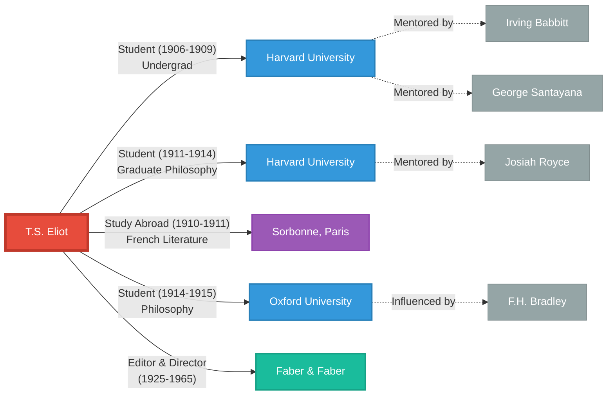

---

## 7. Literary Movements: Relationships and Evolution

### Explanation

This diagram traces the evolution and relationships between literary movements from the 19th century through postmodernism, showing Eliot's position within this historical arc. The French Symbolist and Decadent movements of the late 19th century influenced early Imagism (Pound's movement), which fed into the broader Modernism that Eliot came to define. Modernism in turn influenced or provoked reactions: New Criticism (which institutionalized Eliot's critical theories in academia), Movement Poetry (British poets reacting against modernist difficulty), and Confessional Poetry (which paradoxically both rejected and depended on modernist precedent). Finally, Postmodernism emerges as both continuation and critique of modernist assumptions.

This movement network is essential for contextualizing individual poets and works. When we say Eliot is associated with Modernism, we're not just applying a label but positioning him within a complex ecosystem of aesthetic principles, oppositions, and historical forces. The "opposed to" relationships (Movement Poetry opposing Modernism, Confessional rejecting impersonality) are as important as the influence relationships. For AI testing, this challenges systems to model not just linear influence but dialectical relationships, reactions, and the evolution of aesthetic ideas over time.

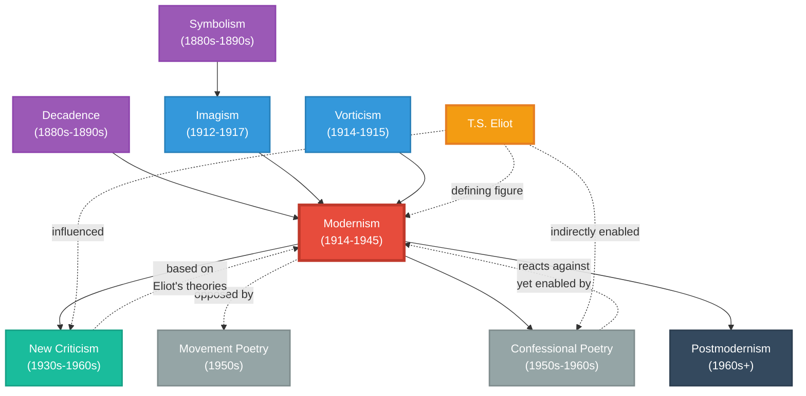

---

## 8. The Waste Land: Intertextual Web

### Explanation

This diagram visualizes the dense network of allusions in The Waste Land, demonstrating why this poem is ideal for testing LLM comprehension of complex intertextuality. The poem draws simultaneously on classical mythology (Ovid's Metamorphoses, Greek tragedy), medieval literature (Dante's Divine Comedy, Arthurian legend via Jessie Weston), Renaissance drama (Shakespeare's The Tempest), 19th-century symbolism (Baudelaire), opera (Wagner's Tristan und Isolde), anthropology (Frazer's The Golden Bough), and Eastern religious texts (the Upanishads). Each allusion isn't merely decorative but carries semantic weight that modifies the poem's meaning.

This represents exactly the kind of semantic density that challenges AI systems. An LLM must not only identify allusions (relatively straightforward with training data) but understand how they function: why Dante's Inferno appears in the London Bridge passage, how the Philomela myth from Ovid connects to the theme of violated communication, why the Sanskrit "Shantih shantih shantih" ending creates a particular resonance. The ontology's LiteraryWork class includes an "allusionsTo" property precisely to capture these relationships, enabling queries like "What works does The Waste Land allude to that also appear in Four Quartets?" or "Map the anthropological sources behind Eliot's fertility myth structure."

```mermaid
graph TD
    WL["The Waste Land<br/>(1922)"]
    
    WL --> A1["Dante: Divine Comedy<br/>Infernal/Purgatorial imagery"]
    WL --> A2["Shakespeare: The Tempest<br/>Ariel's song, sea change"]
    WL --> A3["Ovid: Metamorphoses<br/>Tiresias, Philomela"]
    WL --> A4["Webster: The White Devil<br/>Jacobean death imagery"]
    WL --> A5["Baudelaire: Flowers of Evil<br/>Urban decay, ennui"]
    WL --> A6["Wagner: Tristan und Isolde<br/>Love-death theme"]
    WL --> A7["Weston: From Ritual to Romance<br/>Fisher King myth"]
    WL --> A8["Frazer: The Golden Bough<br/>Vegetation ritual"]
    WL --> A9["Upanishads<br/>Shantih mantra"]
    WL --> A10["St. Augustine: Confessions<br/>Spiritual autobiography"]
    WL --> A11["Buddha: Fire Sermon<br/>Desire and suffering"]
    WL --> A12["Spenser: Prothalamion<br/>Thames river imagery"]
    
    style WL fill:#E74C3C,stroke:#C0392B,stroke-width:4px,color:#fff
    style A1 fill:#3498DB,stroke:#2980B9,stroke-width:2px,color:#fff
    style A2 fill:#3498DB,stroke:#2980B9,stroke-width:2px,color:#fff
    style A3 fill:#3498DB,stroke:#2980B9,stroke-width:2px,color:#fff
    style A4 fill:#3498DB,stroke:#2980B9,stroke-width:2px,color:#fff
    style A5 fill:#9B59B6,stroke:#8E44AD,stroke-width:2px,color:#fff
    style A6 fill:#9B59B6,stroke:#8E44AD,stroke-width:2px,color:#fff
    style A7 fill:#E67E22,stroke:#D35400,stroke-width:2px,color:#fff
    style A8 fill:#E67E22,stroke:#D35400,stroke-width:2px,color:#fff
    style A9 fill:#1ABC9C,stroke:#16A085,stroke-width:2px,color:#fff
    style A10 fill:#1ABC9C,stroke:#16A085,stroke-width:2px,color:#fff
    style A11 fill:#1ABC9C,stroke:#16A085,stroke-width:2px,color:#fff
    style A12 fill:#3498DB,stroke:#2980B9,stroke-width:2px,color:#fff
```

---

## 9. Critical Interpretations: Evolution Over Time

### Explanation

This flowchart traces how critical interpretations of Eliot's work evolved across seven decades, showing how each generation brings new frameworks and concerns to bear on the same texts. The New Critical approach (1940s-1960s) focused on textual unity and formal analysis, reading The Waste Land as organically coherent beneath its fragmentary surface. Biographical studies (1970s-1980s) excavated Eliot's personal life, particularly his troubled first marriage, reading the poetry as encoded autobiography. Feminist criticism (1980s-1990s) interrogated Eliot's representation of women and gender dynamics. Postcolonial approaches (1990s-2000s) examined his Eurocentrism and cultural appropriation. Digital humanities methods (2000s-present) apply computational tools to network analysis and distant reading.

This temporal dimension of interpretation is crucial for the ontology because it demonstrates that literary meaning isn't static—it's continually reconstituted by new critical frameworks. The CriticalInterpretation class includes properties for interpretive framework, key arguments, and influence on later interpretations precisely to capture this evolution. For your AI/agentic consulting work, this illustrates how knowledge graphs must accommodate multiple, sometimes contradictory readings of the same cultural objects, and how "influence" operates not just between artists but between critics and interpretive communities over time.

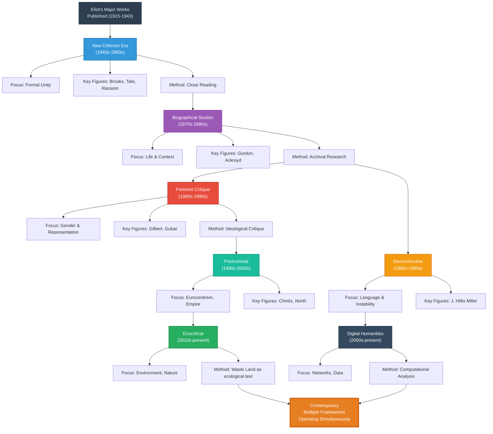

---

## 10. Geographic Context: Eliot's Literary Geography

### Explanation

This diagram maps the geographic dimension of Eliot's life and literary network, showing how specific places shaped and were shaped by his work. St. Louis represents his American roots and the Midwest industrial landscape that haunts poems like The Waste Land. Harvard/Cambridge provided intellectual formation and exposure to philosophical idealism. Paris meant immersion in French Symbolist poetry and European avant-garde culture. London became his permanent home and the center of English-language modernism—Bloomsbury for the literary scene, Russell Square for Faber & Faber, the Thames as poetic landscape. Oxford and Little Gidding represent philosophical study and Anglican spiritual retreat respectively.

Geographic context matters because literature is always produced somewhere, and places carry cultural, social, and symbolic meanings that inflect literary creation. Eliot's poetry is full of place references—the "Unreal City" of London, the New England coastline of The Dry Salvages, the rose garden of Burnt Norton. The GeographicContext class enables the ontology to capture not just where Eliot lived but what places meant: institutions, literary salons, landscapes that became symbols, cities that embodied cultural conditions. For AI evaluation, this tests whether systems can parse multi-dimensional context: geographic facts (lat/long coordinates) plus cultural significance plus literary representation.

```mermaid
graph TB
    subgraph "American Origins"
        STL["St. Louis, Missouri<br/>(1888-1906)<br/>Childhood, Industrial Midwest"]
        HRV["Harvard/Cambridge, MA<br/>(1906-1910, 1911-1914)<br/>Intellectual Formation"]
    end
    
    subgraph "European Transformation"
        PAR["Paris/Sorbonne<br/>(1910-1911)<br/>French Literary Culture"]
        OXF["Oxford<br/>(1914-1915)<br/>Philosophy, Bradley Studies"]
    end
    
    subgraph "London: Permanent Center"
        BLM["Bloomsbury<br/>Literary Scene, Woolf Circle"]
        RSQ["Russell Square<br/>Faber & Faber Offices"]
        THM["The Thames<br/>Poetic Landscape"]
    end
    
    subgraph "Spiritual Sites"
        LGD["Little Gidding<br/>Anglican Community<br/>Spiritual Retreat"]
    end
    
    E["T.S. Eliot"]
    
    STL --> E
    HRV --> E
    PAR --> E
    OXF --> E
    BLM --> E
    RSQ --> E
    THM --> E
    LGD --> E
    
    style E fill:#E74C3C,stroke:#C0392B,stroke-width:4px,color:#fff
    style STL fill:#3498DB,stroke:#2980B9,stroke-width:2px,color:#fff
    style HRV fill:#3498DB,stroke:#2980B9,stroke-width:2px,color:#fff
    style PAR fill:#9B59B6,stroke:#8E44AD,stroke-width:2px,color:#fff
    style OXF fill:#9B59B6,stroke:#8E44AD,stroke-width:2px,color:#fff
    style BLM fill:#1ABC9C,stroke:#16A085,stroke-width:2px,color:#fff
    style RSQ fill:#1ABC9C,stroke:#16A085,stroke-width:2px,color:#fff
    style THM fill:#1ABC9C,stroke:#16A085,stroke-width:2px,color:#fff
    style LGD fill:#F39C12,stroke:#E67E22,stroke-width:2px,color:#fff
```

---

## 11. Intellectual Concepts: Ontological Domains

### Explanation

This diagram categorizes the intellectual concepts that appear in Eliot's work by their primary ontological domain, showing the interdisciplinary nature of his poetry and criticism. Aesthetic concepts include his theoretical innovations like the Objective Correlative and Dissociation of Sensibility, plus structural principles like the Mythic Method. Theological concepts dominate his later work: Incarnation, Redemption Through Suffering, Via Negativa (the mystical path of negation). Philosophical concerns span time/eternity paradoxes, the relationship between tradition and innovation, and questions of consciousness. Psychological themes include fragmentation, alienation, and self-consciousness as paralysis.

This multi-domain structure reflects the reality that great literature doesn't respect disciplinary boundaries—Eliot's poetry is simultaneously aesthetic object, philosophical meditation, theological inquiry, and psychological exploration. The IntellectualConcept class includes a "conceptDomain" property precisely to capture this cross-cutting quality. For your work testing LLM capabilities with abstract concepts, this challenges AI systems to recognize that concepts don't exist in isolation but operate across multiple domains simultaneously. Can an LLM understand that "Time and Eternity" is not just a philosophical abstraction but also a theological problem and a phenomenological experience that manifests differently in different works?

```mermaid
graph LR
    subgraph "Aesthetic Concepts"
        A1["Objective Correlative"]
        A2["Dissociation of<br/>Sensibility"]
        A3["Mythic Method"]
        A4["Impersonality of Art"]
    end
    
    subgraph "Theological Concepts"
        T1["Incarnation"]
        T2["Redemption Through<br/>Suffering"]
        T3["Via Negativa"]
        T4["Mystical Union"]
    end
    
    subgraph "Philosophical Concepts"
        P1["Time and Eternity"]
        P2["Tradition vs Innovation"]
        P3["Consciousness &<br/>Experience"]
        P4["Knowledge & Reality"]
    end
    
    subgraph "Psychological Concepts"
        PS1["Fragmentation"]
        PS2["Modern Alienation"]
        PS3["Self-Consciousness<br/>as Paralysis"]
    end
    
    subgraph "Cultural Concepts"
        C1["Cultural Memory"]
        C2["Spiritual Drought/<br/>Waste Land"]
        C3["Death and Rebirth"]
    end
    
    E["T.S. Eliot's<br/>Intellectual Universe"]
    
    A1 --> E
    A2 --> E
    A3 --> E
    A4 --> E
    
    T1 --> E
    T2 --> E
    T3 --> E
    T4 --> E
    
    P1 --> E
    P2 --> E
    P3 --> E
    P4 --> E
    
    PS1 --> E
    PS2 --> E
    PS3 --> E
    
    C1 --> E
    C2 --> E
    C3 --> E
    
    style E fill:#E74C3C,stroke:#C0392B,stroke-width:4px,color:#fff
    style A1 fill:#3498DB,stroke:#2980B9,stroke-width:2px,color:#fff
    style A2 fill:#3498DB,stroke:#2980B9,stroke-width:2px,color:#fff
    style A3 fill:#3498DB,stroke:#2980B9,stroke-width:2px,color:#fff
    style A4 fill:#3498DB,stroke:#2980B9,stroke-width:2px,color:#fff
    style T1 fill:#9B59B6,stroke:#8E44AD,stroke-width:2px,color:#fff
    style T2 fill:#9B59B6,stroke:#8E44AD,stroke-width:2px,color:#fff
    style T3 fill:#9B59B6,stroke:#8E44AD,stroke-width:2px,color:#fff
    style T4 fill:#9B59B6,stroke:#8E44AD,stroke-width:2px,color:#fff
    style P1 fill:#1ABC9C,stroke:#16A085,stroke-width:2px,color:#fff
    style P2 fill:#1ABC9C,stroke:#16A085,stroke-width:2px,color:#fff
    style P3 fill:#1ABC9C,stroke:#16A085,stroke-width:2px,color:#fff
    style P4 fill:#1ABC9C,stroke:#16A085,stroke-width:2px,color:#fff
    style PS1 fill:#E67E22,stroke:#D35400,stroke-width:2px,color:#fff
    style PS2 fill:#E67E22,stroke:#D35400,stroke-width:2px,color:#fff
    style PS3 fill:#E67E22,stroke:#D35400,stroke-width:2px,color:#fff
    style C1 fill:#F39C12,stroke:#E67E22,stroke-width:2px,color:#fff
    style C2 fill:#F39C12,stroke:#E67E22,stroke-width:2px,color:#fff
    style C3 fill:#F39C12,stroke:#E67E22,stroke-width:2px,color:#fff
```

---

## 12. Influence Strength and Type Matrix

### Explanation

This diagram visualizes influence relationships along two dimensions: strength (foundational, major, moderate) and type (thematic, stylistic, philosophical, technical). Foundational influences like Dante and Laforgue profoundly shaped Eliot's entire poetic project—Dante's spiritual vision provided the ultimate model, while Laforgue's ironic technique enabled the voice of early poems. Major influences like Baudelaire, Donne, and Pound had substantial but more circumscribed impact—Baudelaire's urban themes, Donne's metaphysical wit, Pound's editorial guidance. Moderate influences like specific philosophers or contemporaries contributed particular elements without transforming the whole.

This two-dimensional representation captures the reality that not all influences are created equal, and influence operates through different mechanisms. The InfluenceRelationship class includes both influenceStrength and influenceType properties to enable this nuanced modeling. A foundational thematic influence (Dante) functions very differently from a major technical influence (Pound's editing) or a moderate stylistic influence. For your LLM testing, this challenges AI systems to make qualitative judgments about relationships—not just "A influenced B" but "how much, in what way, with what evidence?" Can AI parse the difference between foundational and moderate influence, or between thematic and technical transmission?

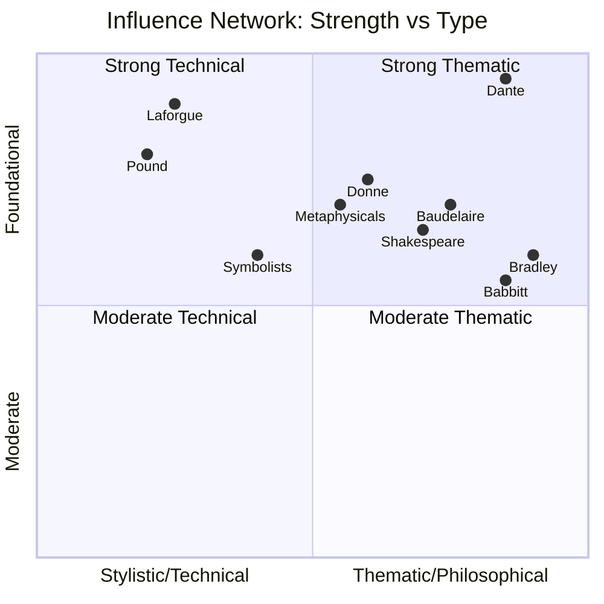

---

## 13. Knowledge Graph Query Patterns

### Explanation

This flowchart illustrates the decision logic for determining which type of query to use when interrogating the Eliot knowledge graph in different database implementations. For simple fact retrieval (like "When was The Waste Land published?"), direct property queries suffice. For relationship traversal (like "Who influenced Eliot?"), single-hop graph traversal is appropriate. For lineage tracing (like "What's the influence chain from Dante to contemporary poets through Eliot?"), multi-hop path queries are needed. For pattern matching (like "Find all poets who share three or more thematic concerns with Eliot"), complex graph patterns with filtering are required. For network analysis (like "Who are the most central figures in the modernist network?"), graph algorithms like PageRank or centrality measures apply.

This query pattern taxonomy is crucial because it demonstrates the different ways the knowledge graph can be interrogated depending on the research question. A graph database isn't just a different way to store data—it enables fundamentally different types of questions. For your consulting work, this illustrates how ontology design must anticipate the queries it will support. The Eliot ontology's structure (with first-class InfluenceRelationship entities, temporal properties, strength/type qualifications) enables sophisticated queries that would be difficult or impossible in a relational database. For AI testing, this challenges LLMs to not just retrieve facts but to reason about graph structures, traverse relationships, and identify patterns.

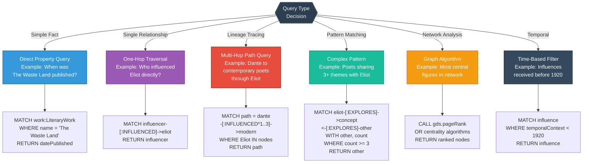

---

## 14. Data Population Workflow

### Explanation

This sequence diagram illustrates the step-by-step workflow for populating the Eliot ontology, showing the recommended order of operations and the interactions between different entity types. The process begins with creating core entities (Eliot himself, major works, key influences), then adds contextual entities (institutions, movements, geographic locations), and finally populates the rich relational data (influences, interpretations, themes). This ordering is strategic: you need entities to exist before you can create relationships between them, and you need basic relationships (like authorship) before you can add qualified relationships (like influence with strength/type metadata).

The validation step at each stage ensures data quality and consistency. For instance, when creating an influence relationship, the system validates that both influencer and influenced entities exist, that the temporal context makes sense (influencer predates influenced), and that required evidence sources are documented. This workflow discipline is essential for maintaining ontology integrity, especially when multiple contributors are populating the graph. For your consulting work, this demonstrates best practices in knowledge engineering: the importance of phased population, validation at each step, and clear dependencies between entity types. For AI applications, this structured approach enables incremental development and testing—you can populate a minimal viable graph (Phase 1-2) to test queries, then progressively enrich it.

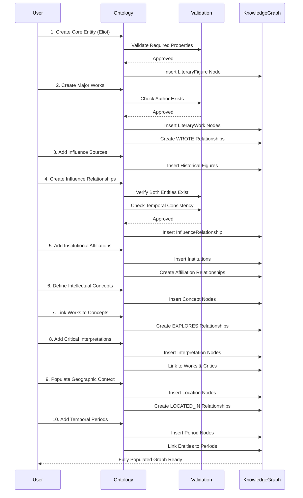

---

## 15. Multi-Generational Influence Cascade

### Explanation

This diagram traces influence across four generations, showing how literary transmission cascades through time with Eliot as the pivotal middle node. Generation 0 (19th century and earlier) includes the foundational figures who shaped Eliot: Dante from medieval Italy, the 17th-century Metaphysical poets, the French Symbolists of the late 19th century. Generation 1 is Eliot himself (1888-1965), who absorbed these influences and synthesized them into modernist poetry. Generation 2 comprises mid-century poets directly influenced by Eliot: Lowell, Berryman, Hughes. Generation 3 includes late-century figures who inherited Eliot's legacy through intermediaries: Heaney, Hill, Walcott. Generation 4 represents contemporary 21st-century poets for whom Eliot is canonical history: Carson, Oswald, Paterson.

This multi-generational view reveals how influence isn't just a two-party transaction but a cascading process where each generation reinterprets and transmits to the next. The weakening or transformation of influence over generations (shown by the thinning lines) reflects how influence diffuses and mutates as it moves through time. For your ontology work, this demonstrates why the InfluenceRelationship class needs temporal properties—"when did this influence occur?" matters as much as "what was influenced?" For AI testing, this challenges systems to reason about transitive relationships, temporal sequence, and the evolution of ideas across multiple generations. Can an LLM trace how Dante's concept of spiritual journey reaches contemporary poetry through four centuries of literary transmission?

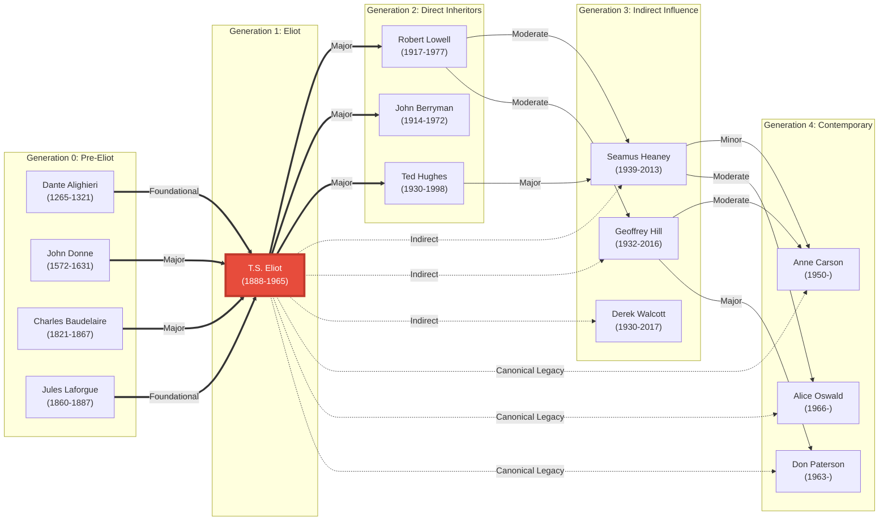

---

## 16. Ontology Implementation Technology Stack

### Explanation

This diagram presents the technology options for implementing the Eliot ontology across four different database architectures, each with distinct advantages. The Graph Database path (Neo4j, Amazon Neptune) excels at relationship traversal and is ideal for influence network analysis—queries like "find all paths from Dante to contemporary poets" are native and efficient. The RDF/Semantic Web path (Apache Jena, Virtuoso) provides maximum interoperability with Linked Open Data and supports SPARQL querying for complex semantic reasoning. The Document Database path (MongoDB, Couchbase) offers flexibility for semi-structured data and is performant for retrieving entire entity documents. The Property Graph path (TinkerPop/Gremlin) provides a standardized graph API that works across multiple backend systems.

Each technology choice involves tradeoffs between query expressiveness, scalability, ecosystem maturity, and learning curve. For your consulting work, this illustrates how ontology design should be implementation-agnostic—the same logical model (the JSON-LD schema) can be realized in multiple physical implementations depending on use case requirements. A research project might prioritize Neo4j for its intuitive Cypher query language, while a production system might choose AWS Neptune for cloud scaling. For AI/agentic applications, this demonstrates the importance of separating logical knowledge representation from physical storage—your AI agents should query the ontology through a consistent API regardless of backend technology.

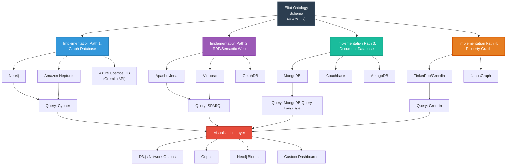

---

## 17. LiteraryWork: Complete Property Model

### Explanation

This comprehensive diagram details every property and relationship type defined for the LiteraryWork class, demonstrating the ontology's granularity in representing literary texts. Basic properties include title, author, publication date, and genre (poetry, criticism, drama). Structural properties capture form-specific details like the five sections of The Waste Land or the four poems comprising Four Quartets. Semantic properties include themes, techniques, and the dense network of allusions that characterize modernist poetry. Reception properties track critical interpretations and cultural impact over time. Relational properties connect works to concepts, movements, other works, and publication events.

This level of detail enables the ontology to support sophisticated literary analysis queries. You can ask "Which works employ stream of consciousness technique?", "What allusions appear in both The Waste Land and Four Quartets?", "How did critical interpretations of Ash-Wednesday evolve over time?", or "Which themes appear most frequently across Eliot's oeuvre?" For your LLM testing work, this granular property model provides a benchmark for evaluating how well AI systems can extract and structure information from complex literary texts. Can an LLM, given The Waste Land, identify not just obvious features (it's a poem by Eliot) but subtle ones (specific literary techniques, the function of particular allusions, thematic connections to other works)?

```mermaid
graph TD
    LW["LiteraryWork Class"]
    
    LW --> BP["Basic Properties"]
    BP --> BP1["name"]
    BP --> BP2["alternateName"]
    BP --> BP3["author → LiteraryFigure"]
    BP --> BP4["datePublished"]
    BP --> BP5["dateCreated/Composed"]
    BP --> BP6["workType<br/>(Poetry, Criticism,<br/>Drama, Essay)"]
    BP --> BP7["abstract/description"]
    BP --> BP8["inLanguage"]
    BP --> BP9["numberOfPages/lines"]
    
    LW --> SP["Structural Properties"]
    SP --> SP1["hasPart<br/>(sections, stanzas)"]
    SP --> SP2["structure<br/>(formal organization)"]
    
    LW --> SEM["Semantic Properties"]
    SEM --> SEM1["themes → IntellectualConcept[]"]
    SEM --> SEM2["literaryTechniques[]<br/>(fragmentation, allusion,<br/>stream of consciousness)"]
    SEM --> SEM3["allusionsTo → Work[]<br/>or Concept[]"]
    SEM --> SEM4["intertextualRelations → Work[]"]
    
    LW --> REL["Relational Properties"]
    REL --> REL1["dedicatedTo → Person"]
    REL --> REL2["publisher → Organization"]
    REL --> REL3["associatedMovement → Movement"]
    REL --> REL4["intellectualInfluences[]"]
    
    LW --> REC["Reception Properties"]
    REC --> REC1["criticalReception<br/>→ CriticalInterpretation[]"]
    REC --> REC2["culturalImpact[]<br/>(textual descriptions)"]
    REC --> REC3["publicationHistory<br/>→ PublicationEvent[]"]
    
    style LW fill:#3498DB,stroke:#2980B9,stroke-width:3px,color:#fff
    style BP fill:#5DADE2,stroke:#3498DB,stroke-width:2px,color:#fff
    style SP fill:#5DADE2,stroke:#3498DB,stroke-width:2px,color:#fff
    style SEM fill:#5DADE2,stroke:#3498DB,stroke-width:2px,color:#fff
    style REL fill:#5DADE2,stroke:#3498DB,stroke-width:2px,color:#fff
    style REC fill:#5DADE2,stroke:#3498DB,stroke-width:2px,color:#fff
```

---

## 18. Minimal Viable Ontology Population

### Explanation

This diagram illustrates the "minimal viable population" approach for quickly creating a functional knowledge graph with just 38 carefully selected entities. This subset includes Eliot as the core node, his six most significant works (Prufrock, The Waste Land, Hollow Men, Ash-Wednesday, Four Quartets, Murder in the Cathedral), ten major influences he received (from Dante and Donne to Pound and Bradley), ten figures he influenced (from Lowell and Heaney to Carson and Brooks), three key movements (Modernism, New Criticism, Confessional Poetry), five essential concepts (Objective Correlative, Time and Eternity, etc.), and three crucial institutions (Harvard, Oxford, Faber & Faber).

This strategic subset captures the ontology's essential structure and relationship types while remaining manageable for initial population and testing. Even with just 38 nodes, you can demonstrate all ten entity classes, all major relationship types, and meaningful queries across multiple dimensions (influence tracing, thematic analysis, institutional context, temporal evolution). For your consulting work, this illustrates the principle of incremental development—start with a minimal but representative dataset to validate the model, test queries, and refine the schema before investing in comprehensive population. For AI testing, this provides a controlled environment for evaluating LLM performance on a well-defined, manageable knowledge domain before scaling to the full complexity of Eliot's literary network.

```mermaid
graph TD
    Start["Minimal Viable<br/>Ontology<br/>(38 Entities)"]
    
    Start --> Core["Core Entity (1)"]
    Core --> CE1["T.S. Eliot"]
    
    Start --> Works["Major Works (6)"]
    Works --> W1["Prufrock"]
    Works --> W2["The Waste Land"]
    Works --> W3["The Hollow Men"]
    Works --> W4["Ash-Wednesday"]
    Works --> W5["Four Quartets"]
    Works --> W6["Murder in the Cathedral"]
    
    Start --> InflIn["Key Influences<br/>Received (10)"]
    InflIn --> I1["Dante"]
    InflIn --> I2["Baudelaire"]
    InflIn --> I3["Laforgue"]
    InflIn --> I4["Donne"]
    InflIn --> I5["Shakespeare"]
    InflIn --> I6["Pound"]
    InflIn --> I7["Bradley"]
    InflIn --> I8["Royce"]
    InflIn --> I9["St. John of the Cross"]
    InflIn --> I10["Bhagavad Gita"]
    
    Start --> InflOut["Key Influences<br/>Exerted (10)"]
    InflOut --> O1["Auden"]
    InflOut --> O2["Lowell"]
    InflOut --> O3["Berryman"]
    InflOut --> O4["Hughes"]
    InflOut --> O5["Heaney"]
    InflOut --> O6["Hill"]
    InflOut --> O7["Walcott"]
    InflOut --> O8["Carson"]
    InflOut --> O9["Brooks"]
    InflOut --> O10["Tate"]
    
    Start --> Mvmt["Movements (3)"]
    Mvmt --> M1["Modernism"]
    Mvmt --> M2["New Criticism"]
    Mvmt --> M3["Confessional Poetry"]
    
    Start --> Concepts["Concepts (5)"]
    Concepts --> C1["Objective Correlative"]
    Concepts --> C2["Tradition & Individual Talent"]
    Concepts --> C3["Time and Eternity"]
    Concepts --> C4["Dissociation of Sensibility"]
    Concepts --> C5["Mythic Method"]
    
    Start --> Inst["Institutions (3)"]
    Inst --> IN1["Harvard"]
    Inst --> IN2["Oxford"]
    Inst --> IN3["Faber & Faber"]
    
    style Start fill:#2C3E50,stroke:#34495E,stroke-width:3px,color:#ECF0F1
    style Core fill:#E74C3C,stroke:#C0392B,stroke-width:2px,color:#fff
    style Works fill:#3498DB,stroke:#2980B9,stroke-width:2px,color:#fff
    style InflIn fill:#9B59B6,stroke:#8E44AD,stroke-width:2px,color:#fff
    style InflOut fill:#1ABC9C,stroke:#16A085,stroke-width:2px,color:#fff
    style Mvmt fill:#F39C12,stroke:#E67E22,stroke-width:2px,color:#fff
    style Concepts fill:#E67E22,stroke:#D35400,stroke-width:2px,color:#fff
    style Inst fill:#27AE60,stroke:#229954,stroke-width:2px,color:#fff
```

---

## Conclusion

These 18 Mermaid diagrams provide comprehensive visualization of the T.S. Eliot Literary Lineage and Influence Ontology from multiple perspectives: structural (class hierarchies, property models), relational (influence networks, institutional affiliations), temporal (life phases, critical evolution), conceptual (themes, intellectual domains), and operational (query patterns, implementation technologies, population workflows).

Each diagram serves a specific analytical or pedagogical purpose:
- **Diagrams 1-2** define the ontology's structural foundation
- **Diagrams 3-6** map temporal, influence, and institutional dimensions
- **Diagrams 7-8** trace movement evolution and intertextual networks
- **Diagrams 9-12** explore critical reception, geography, concepts, and influence metrics
- **Diagrams 13-16** address implementation, querying, and technology choices
- **Diagrams 17-18** detail property models and population strategies

Together, they demonstrate how a sophisticated literary knowledge graph can capture the multi-dimensional complexity of a major author's work, influence, and reception—providing a robust framework for computational literary analysis, digital humanities research, and AI capability testing with abstract, ambiguous cultural knowledge.
